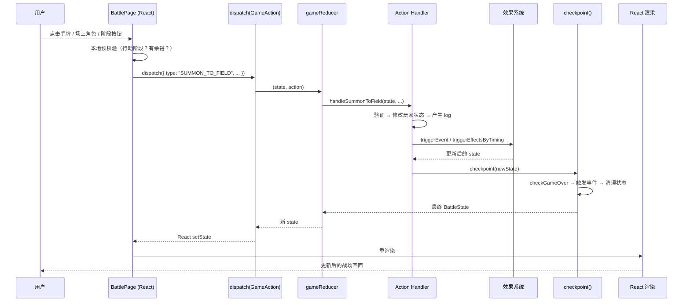
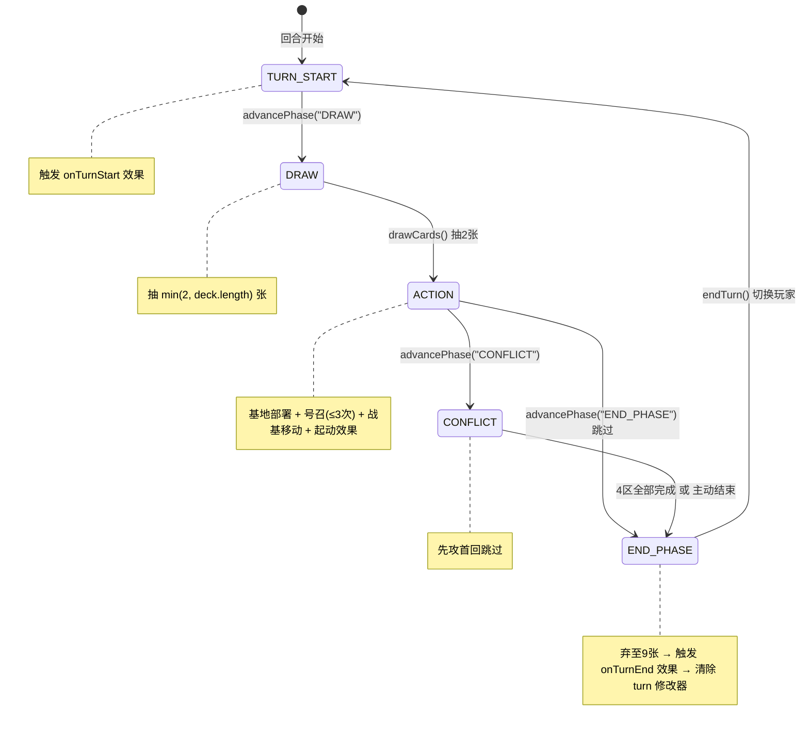

# 超英击战（Marvel TCG）对战模块开发指南

> **面向读者**：新加入的对战模块开发者。本文档帮助你在 30 分钟内理解对战系统的完整架构，并能独立开发新卡牌效果。

---

## 目录

1. [快速上手（5分钟）](#1-快速上手5分钟)
2. [架构总览](#2-架构总览)
3. [类型系统（核心契约）](#3-类型系统核心契约)
4. [对战模块文件地图](#4-对战模块文件地图)
5. [如何新增一张卡的卡效](#5-如何新增一张卡的卡效)
6. [UI 组件树](#6-ui-组件树)
7. [对战模块不碰的边界](#7-对战模块不碰的边界)
8. [协作约定](#8-协作约定)

---

## 1. 快速上手（5分钟）

### 启动开发环境

```bash
cd marvel-tcg
npm install && npm run dev
```

Vite 开发服务器默认在 `http://localhost:5173` 启动。

### 访问对战页面

在浏览器中打开应用后，点击顶部导航栏的 **「对战」** tab，即可进入对战大厅。

对战页面路由由 `App.tsx` 中的 Tab 切换控制（非 URL 路由），Battle 对应的 Tab key 为 `"battle"`。

### 运行测试

```bash
npm test
```

使用 [Vitest](https://vitest.dev/) 运行测试。当前仅有一个测试文件：

- `src/game/__tests__/engine.test.ts` — 引擎核心逻辑测试

### 技术栈

| 层级 | 技术 |
|------|------|
| 构建 | Vite 6 |
| UI | React 18 + Tailwind CSS 3 |
| 语言 | TypeScript 5.7 |
| 测试 | Vitest 4 |
| 状态管理 | `useReducer`（无第三方状态库） |

---

## 2. 架构总览

### 核心设计：Command → Reducer → Checkpoint

对战模块采用**单向数据流**的 Command-Reducer-Checkpoint 三层架构：

```
用户操作 → dispatch(GameAction) → gameReducer（纯函数）→ checkpoint（后处理）→ 新 BattleState → React 渲染
```

#### 三层职责

| 层 | 位置 | 职责 |
|----|------|------|
| **Command** | 用户在 UI 上的操作 | 点击手牌、点击场上角色、按阶段按钮 → 触发 `dispatch(action)` |
| **Reducer** | `src/game/engine.ts` | 纯函数 `(state, action) => newState`，处理所有游戏逻辑。相同输入永远产生相同输出，**无副作用** |
| **Checkpoint** | `engine.ts` 中的 `checkpoint()` | 每次 action 处理后自动运行：①检查胜负条件 ②触发事件监听器 ③清理过期状态 |

#### 数据流图



### 对战模块与项目其他部分的接口边界

对战模块是一个**自包含系统**，它与项目其他部分之间通过 `App.tsx` 传入 3 个 prop：

```typescript
// BattlePage 的 props 接口
interface BattlePageProps {
  db: CardDatabase;        // 卡牌数据库（全局，来自 cards.json）
  savedDecks: Deck[];      // 用户保存的卡组列表（来自 localStorage）
  cardMap: Map<string, Card>; // card_no → Card 映射（快速查找）
}
```

**对战模块不依赖**：路由、全局状态管理、其他页面的组件。

对战模块**输出**：无。对战过程不需要持久化（每局游戏独立）。

---

## 3. 类型系统（核心契约）

### 3.1 BattleState — 完整对战状态

`BattleState` 是游戏唯一的真相来源（single source of truth）。定义在 `src/types/game.ts`。

```
BattleState
├── isSetup: boolean            // 是否在准备阶段
├── setupPhase: SetupPhase      // 开局流程阶段
├── turnPhase: TurnPhase        // 当前回合阶段（见 3.3）
├── players: [PlayerState×2]    // 双方玩家状态（见 3.4）
├── activePlayerIndex: 0|1      // 当前活跃玩家
├── turnNumber: number          // 回合计数（从1开始）
├── remainingSummons: number    // 剩余号召次数（首回先攻1次，其余3次）
├── baseDeployedThisTurn: bool  // 本回合是否已基地部署
├── baseMovesUsed: Record       // 本回合战基移动次数
├── conflictZonesCompleted      // 冲突阶段已完成的区域
├── conflictAttackedCards       // 已攻击的卡牌 ID
├── conflictSubPhase            // 冲突子阶段："adjust"|"attack"
├── conflictMovesUsed           // 冲突调整已用次数（上限4）
├── currentAttackZone           // 当前选中的攻击区域
├── pendingAttack               // 待确认的攻击选择
├── pendingSummon               // 待完成的号召（Lv4+撤退选择）
├── pendingCounter              // 待处理的应对窗口
├── pendingTargetSelection      // 待处理的目标选择
├── eventListeners              // 已注册的事件监听器
├── registeredAbilities         // 已注册的能力
├── modifiers                   // 临时修改器（战力/R值）
├── attachments                 // 结附关系：宿主→结附卡[]
├── enteredThisTurn             // 本回合进场的卡牌（不可移动）
├── counterUsedThisTurn         // 本回合应对使用情况
├── conflictAttackCount         // 连击追踪
├── temporaryAbilities          // 临时关键词能力
├── effectUsedThisTurn          // 本回合已使用的"回合1次"效果
├── activatedEffectsThisTurn    // 本回合已起动的效果
├── mulliganSelected            // 开局调度选中的手牌
├── log: string[]               // 对战日志
├── isGameOver: boolean         // 游戏是否结束
└── winner: number|null         // 胜者索引
```

### 3.2 GameAction — 所有游戏命令的联合类型

定义在 `src/game/types.ts`。以下是所有 Action 及其触发场景：

| Action Type | 触发场景 |
|-------------|----------|
| `SETUP_COMPLETE` | GameSetup 完成开局准备，传入初始 BattleState |
| `RESET_BATTLE` | 游戏结束/重新开始，返回大厅 |
| `DRAW_CARDS` | 抽卡阶段：抽 2 张牌 |
| `ADVANCE_PHASE` | 推进到指定阶段（DRAW→ACTION→CONFLICT→END_PHASE） |
| `END_TURN` | 结束回合：弃至 9 张 → 切换玩家 |
| `DEPLOY_TO_BASE` | 基地部署：手牌 → 基地（盖放），抽 1 张 |
| `SUMMON_TO_FIELD` | 号召上场：手牌 → 战区/基地 |
| `MOVE_CHARACTER` | 战区移动：角色在 4 个战区之间移动 |
| `MOVE_CARD` | 战基移动：角色在战区与基地之间移动 |
| `SET_ATTACK_ZONE` | 设置冲突阶段的攻击区域 |
| `START_ATTACK` | 选择攻击者（设置 pendingAttack） |
| `CONFIRM_ATTACK` | 确认攻击目标 → 战斗判定 |
| `SKIP_ZONE` | 跳过某区域 |
| `START_ATTACK_SUBPHASE` | 从调整子阶段切换到攻击子阶段 |
| `CLEAR_ATTACK_TARGET` | 取消攻击者选择 |
| `SELECT_RETREAT` | Lv4+ 号召时选择撤退目标 |
| `CANCEL_SUMMON` | 取消当前号召 |
| `SETUP_DRAW_HANDS` | 开局调度：设置初始手牌 |
| `MULLIGAN_SELECT` | 开局调度：选择要调整的手牌 |
| `MULLIGAN_CONFIRM` | 开局调度：确认调整 |
| `TRIGGER_COUNTER` | 应对阶段：使用手牌中【应对】角色 |
| `RESOLVE_COUNTER` | 应对阶段：使用应对·起动效果 |
| `PASS_COUNTER` | 应对阶段：选择不行动 |
| `ACTIVATE_EFFECT` | 起动效果：从手牌/基地/场上起动 |
| `SELECT_TARGETS` | 效果目标选择确认 |
| `CANCEL_TARGET_SELECTION` | 取消目标选择 |

### 3.3 TurnPhase — 阶段状态机



**CONFLICT 阶段的子状态机**：

```
adjust → (click "开始攻击") → attack → (4区完成) → END_PHASE
   ↑                              │
   └── 最多4次位置调整            └── 连击角色可攻击2次
```

### 3.4 PlayerState — 玩家状态

```typescript
interface PlayerState {
  id: 1 | 2;                    // 玩家编号
  name: string;                 // 玩家名称
  deck: string[];               // 主卡组（50张，card ID 列表，顶部=索引0）
  rushDeck: string[];           // 冲击卡组（9张）
  hand: string[];               // 手牌
  baseCards: string[];          // 基地 — 正面向上的角色卡
  baseCovered: string[];        // 基地 — 背面向上盖放的盖卡
  field: {                      // 战区
    vanguard: string[];         //   先锋区（每区限1张）
    flankLeft: string[];        //   侧翼左区
    flankRight: string[];       //   侧翼右区
    rear: string[];             //   后卫区
  };
  timeline: string[];           // 时间线（被攻入的冲击卡，≥9判负）
  retreat: string[];            // 撤退区
  void: string[];               // 虚空区
  isFirstPlayer: boolean;       // 是否为先攻玩家
}
```

### 3.5 Zone — 战区类型

```typescript
type Zone = "vanguard" | "flankLeft" | "flankRight" | "rear";
```

**冲突阶段攻击顺序**（硬约束）：

```
先锋 (①) → 侧翼左 (②) / 侧翼右 (②) → 后卫 (③)
```

- `flankLeft` 和 `flankRight` 可并行攻击
- 后卫需两侧翼都完成后才可攻击

---

## 4. 对战模块文件地图

> 文件按"只读→谨慎修改→主要修改区"排列。

### 类型定义层（只读，理解即可）

| 文件 | 说明 |
|------|------|
| `src/types/game.ts` | 对战核心类型：`BattleState`, `PlayerState`, `Zone`, `TurnPhase`, `SetupPhase` 等 |
| `src/types/card.ts` | 卡牌数据类型：`Card`, `CardDatabase`, `Deck`, `DeckEntry` |

### 引擎层（修改需谨慎）

| 文件 | 说明 |
|------|------|
| `src/game/engine.ts` | **游戏引擎核心**：`createGameReducer` 工厂函数 + 所有 action handler。纯函数，不可变更新 |
| `src/game/types.ts` | 引擎专用类型：`GameAction` 联合类型、`EventContext`、`Ability` 等 |
| `src/game/cardUtils.ts` | 卡牌辅助纯函数：`getCardPower`, `getEffectivePower`, `hasKeyword`, `canZoneAttack` 等 |
| `src/game/events.ts` | 事件系统：`triggerEvent`, `registerEvent`, `unregisterEvent` |

### 效果系统（主要修改区）

```
src/game/effects/
├── types.ts        # 核心类型：CardEffect, EffectContext, Modifier, TargetSpec
├── registry.ts     # 全局效果注册表 + 查找/触发函数
├── index.ts        # 统一导出 + registerAllEffects() 初始化
├── helpers.ts      # 原子操作函数（抽卡、撤退、裁剪、结附、修改器等）
├── conditions.ts   # 条件谓词函数（特征判定、场上计数、Lv筛选等）
├── sd01.ts         # SD01 卡包的全部卡效定义（19张卡）
└── sd02.ts         # SD02 卡包的全部卡效定义（19张卡）
```

### UI 层

| 文件 | 说明 |
|------|------|
| `src/pages/BattlePage.tsx` | **对战页面入口**：`useReducer` + 事件处理 + 布局编排 |
| `src/components/GameSetup.tsx` | 开局准备界面：洗牌、先后手、调度 |
| `src/components/battle/PlayerArea.tsx` | **玩家区域渲染**：战场、手牌、基地、移动菜单、撤退选择 |
| `src/components/battle/SidebarSection.tsx` | 可折叠侧边栏区块（时间线、撤退区等） |
| `src/components/battle/StatRow.tsx` | 双方数值对比行 |
| `src/components/battle/CardDetailPanel.tsx` | 卡牌详情悬浮面板 |
| `src/components/battle/constants.ts` | 共享常量与 `ActionMode` 类型 |
| `src/components/battle/types.ts` | 组件 Props 类型 |

### 测试

| 文件 | 说明 |
|------|------|
| `src/game/__tests__/engine.test.ts` | 引擎核心逻辑测试 |

---

## 5. 如何新增一张卡的卡效

以 **SD01-001 反浩克装甲** 为例，展示完整流程。

### 步骤 A：在 effects/sdXX.ts 中定义 effect 对象

以 SD01-001 的触发型效果为例（`src/game/effects/sd01.ts`）：

```typescript
// 1. 导入依赖
import type { CardEffect, EffectContext, Modifier } from "./types";
import { registerEffects, triggerEffectsByTiming } from "./registry";
import * as H from "./helpers";   // 原子操作（retreatCard, trimCard, attachCard 等）
import * as C from "./conditions"; // 条件谓词（hasFeature, fieldCount, getCardLevel 等）

// 2. 定义效果对象
const sd01_001: CardEffect = {
  id: "SD01-001-0",              // 命名规则：{cardNo}-{索引}
  cardNo: "SD01-001",            // 关联卡牌编号
  category: "trigger",           // 效果分类：trigger | static | active | counter
  trigger: "onAttached",         // 触发时机（trigger 类型必填）
  once: true,                    // 是否为"回合1次"效果
  label: "反浩克装甲·裁剪",       // UI 显示名称

  // 触发条件（可选，返回 true 才执行）
  triggerCondition: (ctx: EffectContext): boolean => {
    const attachments = ctx.state.attachments[ctx.cardId] ?? [];
    if (attachments.length === 0) return false;
    return C.getOpponentFieldCardsWithMinLv(ctx.state, ctx.playerIdx, ctx.db, 5).length > 0;
  },

  // 效果执行（必填）
  execute: (ctx: EffectContext) => {
    let state = ctx.state;
    // ... 使用 H.* 和 C.* 操作状态 ...
    return state;
  },
};
```

### 效果分类速查

| category | 用途 | 必填字段 | 示例 |
|----------|------|----------|------|
| `trigger` | 当某事发生时自动触发 | `trigger`, `execute` | onSummon 进场效果、onRetreat 撤退效果 |
| `static` | 持续存在的被动效果 | `staticModifier` 或 `execute` | 战力+X000、R值修改 |
| `active` | 玩家手动起动的效果 | `activeSource`, `execute` | 手牌起动、场上起动 |
| `counter` | 应对类型效果（对手号召时） | `execute` | 拦截效果 |

### 可用的触发时机（trigger）

| 时机 | 含义 |
|------|------|
| `onSummon` | 号召进场时 |
| `onRetreat` | 被撤退时 |
| `onAttack` | 攻击时 |
| `onAttached` | 被结附时 |
| `onStatChange` | 战力变化时 |
| `onAllyDefeated` | 友方角色被撤退时 |
| `onTurnStart` | 回合开始时 |
| `onTurnEnd` | 回合结束时 |

### 常用 EffectContext 属性

```typescript
interface EffectContext {
  state: BattleState;    // 当前游戏状态（不可变更新）
  cardId: string;        // 效果来源卡牌 ID
  playerIdx: number;     // 效果来源玩家索引
  db: CardDatabase;      // 卡牌数据库
  targets?: {            // 选定目标（如有 targetSpec）
    cardId?: string;
    zone?: Zone;
    playerIdx?: number;
    cardIds?: string[];
  };
  triggerInfo?: {        // 触发信息（触发型效果）
    event: TriggerTiming;
    sourceCardId?: string;
    sourcePlayerIdx?: number;
  };
}
```

### 常用原子操作（helpers.ts）

| 函数 | 功能 |
|------|------|
| `H.retreatCard(state, cardId, playerIdx, db)` | 将角色移至撤退区 |
| `H.trimCard(state, cardId, playerIdx, db)` | 将角色裁剪（移除出游戏） |
| `H.attachCard(state, cardId, hostId, playerIdx, db)` | 结附到宿主 |
| `H.detachCard(state, cardId, hostId)` | 解除结附 |
| `H.createModifier(state, targetId, type, value, duration, sourceId, db)` | 创建临时修改器 |
| `H.drawCards(state, playerIdx, count, db)` | 抽 N 张牌 |
| `H.moveCardToVoid(state, cardId, playerIdx)` | 移至虚空区 |
| `H.moveRushCard(state, targetPlayerIdx)` | 对方冲击卡入时间线 |

### 常用条件函数（conditions.ts）

| 函数 | 功能 |
|------|------|
| `C.hasFeature(card, featureId)` | 检查特征 |
| `C.hasAttribute(card, attributeId)` | 检查属性 |
| `C.fieldCount(state, playerIdx)` | 我方战区角色数 |
| `C.getCardLevel(db, cardId)` | 获取卡牌 Lv |
| `C.getOpponentFieldCardsWithMinLv(state, playerIdx, db, minLv)` | 敌方场上 Lv≥X 角色列表 |
| `C.retreatCount(state, playerIdx, db, filter?)` | 撤退区角色数 |
| `C.baseFaceDownCount(state, playerIdx)` | 基地盖卡数 |
| `C.hasAttachment(state, cardId)` | 是否有结附卡 |

### 步骤 B：在 index.ts 中注册

在 `src/game/effects/sdXX.ts` 文件底部，调用 `registerEffects`：

```typescript
// sd01.ts 底部
registerEffects([
  sd01_001,
  sd01_002_attach,
  sd01_002_static,
  // ... 其余效果
]);
```

然后在 `src/game/effects/index.ts` 的 `registerAllEffects()` 中确保调用了对应的注册函数：

```typescript
export function registerAllEffects(db?: CardDatabase): void {
  if (effectsInitialized) return;
  effectsInitialized = true;
  registerSD01Effects();  // ← 新卡包只需加一行
  registerSD02Effects();
  // registerSD03Effects(); // 未来新增
}
```

### 步骤 C：编写测试

在 `src/game/__tests__/` 下新建测试文件（如 `effects-sd01.test.ts`）：

```typescript
import { describe, it, expect } from "vitest";
// 测试效果逻辑（需要构造初始 BattleState 和 CardDatabase）
```

**测试要点**：
1. 构造最小的 `BattleState` 作为初始状态
2. 调用效果执行函数
3. 断言状态变更符合预期（查 hand/base/field/retreat 等数组变化）

### 步骤 D：验证

1. `npm run dev` 启动开发服务器
2. 进入对战页面，选择包含新卡牌的卡组
3. 实际打出该卡牌，验证效果是否按预期触发
4. 检查浏览器 Console 有无报错
5. 检查对战日志（左侧栏底部）确认效果执行记录

---

## 6. UI 组件树

```
BattlePage (useReducer + 布局编排)
├── BattleLobby (选择卡组、先后手)
│
├── GameSetup (开局准备：洗牌、调度)
│
├── [左侧栏] SidebarSection × 4
│   ├── 时间线 (双方 timeline 小卡片)
│   ├── 撤退区
│   ├── 虚空区
│   ├── 冲击卡组 (剩余张数)
│   └── 对战日志 (最近80条)
│
├── [中央战场]
│   ├── PlayerArea (敌方, isEnemy=true)
│   │   ├── 手牌区 (面朝下)
│   │   ├── 基地区 (baseCards + baseCovered)
│   │   ├── 战场区 (vanguard/flankLeft/flankRight/rear)
│   │   └── 移动/号召/撤退/攻击 交互覆盖层
│   │
│   ├── VS 分隔线 (回合/阶段/活跃玩家信息)
│   │
│   ├── PlayerArea (我方, isEnemy=false)
│   │   └── ... (同上)
│   │
│   └── 阶段按钮栏 (根据 turnPhase 动态显示)
│       ├── TURN_START → "抽卡阶段"
│       ├── DRAW → "抽2张牌"
│       ├── ACTION → "冲突阶段" + 号召/基地 状态 + 起动按钮 + "跳过→结束"
│       ├── CONFLICT → 调整/攻击 子阶段按钮
│       └── END_PHASE → "结束回合"
│
├── [右侧栏]
│   ├── 卡组信息 (双方卡组剩余张数)
│   ├── StatRow × 5 (手牌/基地/场上/时间线/阶段)
│   └── CardDetailPanel (hover 卡牌时显示详情)
│
├── pendingSummon 覆盖层 (Lv4+ 号召撤退选择)
├── pendingCounter 覆盖层 (应对窗口)
├── pendingTargetSelection 模态框 (效果目标选择)
└── Toast 通知 (⚠️ 错误提示, 3s 自动消失)
```

### 各组件职责一句话

| 组件 | 职责 |
|------|------|
| `BattlePage` | 对战页面主控制器：`useReducer` 管理游戏状态，编排 UI 布局，定义所有事件处理函数 |
| `BattleLobby` | 对战大厅：卡组选择 + 先后手选择 |
| `GameSetup` | 开局准备：洗牌模拟动画、先后手决定、手牌调度（mulligan） |
| `PlayerArea` | 单个玩家的完整区域渲染：手牌 + 基地 + 四个战区 + 交互菜单 |
| `SidebarSection` | 可折叠的侧边栏信息区块 |
| `StatRow` | P1 vs P2 数值对比行（手牌数、基地数等） |
| `CardDetailPanel` | hover 悬浮时的卡牌详情（图片 + 属性 + 效果文字） |

### 关键 UI 状态 vs 游戏状态

**UI 状态**（`useState` 管理，不进入 reducer）：

```typescript
const [actionMode, setActionMode] = useState<ActionMode>({ type: "none" });
// ActionMode:
//   { type: "none" }              — 无操作
//   { type: "handSelect", ... }   — 选了一张手牌，等点击位置
//   { type: "moveMenu", ... }     — 选了一个角色，等选目标位置

const [hoveredCard, setHoveredCard] = useState<Card | null>(null);
const [toast, setToast] = useState<string | null>(null);
const [selectedTargetIds, setSelectedTargetIds] = useState<string[]>([]);
```

**游戏状态**（`useReducer` 管理，通过 dispatch 修改）：

```typescript
const [state, dispatch] = useReducer(createGameReducer(db), null);
// state: BattleState | null
// null = 未开始游戏（大厅/准备阶段）
```

---

## 7. 对战模块不碰的边界

以下文件和目录**属于项目其他部分，对战开发不需要修改**：

### 页面

| 文件 | 所属模块 |
|------|----------|
| `src/pages/WelcomePage.tsx` | 欢迎页 |
| `src/pages/CardSearchPage.tsx` | 卡牌搜索 |
| `src/pages/DeckBuilderPage.tsx` | 组卡器 |
| `src/pages/DeckPlazaPage.tsx` | 卡组广场 |
| `src/pages/ChatPage.tsx` | 聊天页 |
| `src/pages/HelpPage.tsx` | 帮助页 |
| `src/pages/SettingsPage.tsx` | 设置页 |
| `src/pages/AboutPage.tsx` | 关于页 |

### 组件

| 文件 | 所属模块 |
|------|----------|
| `src/components/CardGrid.tsx` | 卡牌网格 |
| `src/components/CardDetailModal.tsx` | 卡牌详情弹窗 |
| `src/components/CardDetailSidebar.tsx` | 卡牌详情侧栏 |
| `src/components/FilterSidebar.tsx` | 筛选侧栏 |
| `src/components/FilterBar.tsx` | 筛选栏 |

### 工具

| 文件 | 所属模块 |
|------|----------|
| `src/utils/deckCode.ts` | 卡组编码/解码 |

### 配置

| 文件 | 所属模块 |
|------|----------|
| `tailwind.config.js` | 全局 Tailwind 配置 |
| `vite.config.ts` | 全局 Vite 配置 |
| `tsconfig.json` | 全局 TypeScript 配置 |
| `src/index.css` | 全局样式 |
| `src/main.tsx` | 应用入口 |
| `src/App.tsx` | 应用根组件（除非需要在顶部 Tab 加新页，否则不碰） |

### 测试

| 文件 | 说明 |
|------|------|
| `src/game/__tests__/engine.test.ts` | **可以改**（加新的引擎测试） |

---

## 8. 协作约定

### 分支策略

```
main ← feature/battle-xxx
```

- `main` 分支保持可运行状态
- 对战相关功能在 `feature/battle-*` 分支开发
- 提交前确保 `npm test` 通过

### 新增卡效的文件命名规范

```
src/game/effects/
├── sd01.ts     # SD01 卡包
├── sd02.ts     # SD02 卡包
├── bp01.ts     # BP01 卡包（未来新增）
└── ...
```

- 文件名使用卡包前缀小写（如 `sd01`, `bp01`）
- 每张卡的 effect 对象命名：`{cardNo}-{索引}`（如 `SD01-001-0`）
- 同一个 cardNo 的多个效果使用不同索引（-0, -1, -2...）
- 每张卡的 effect 对象变量名使用下划线区分（如 `sd01_001`, `sd01_002_attach`, `sd01_002_static`）

### 新增 GameAction 的流程

当卡效需要新的交互行为时，才需要新增 GameAction：

1. 在 `src/game/types.ts` 的 `GameAction` 联合类型中添加新类型
2. 在 `src/game/engine.ts` 的 `gameReducer` switch 中添加新 case
3. 实现对应的 handler 函数
4. 在 `src/pages/BattlePage.tsx` 中添加对应的 dispatch 调用
5. 编写测试

### PR Review 关注点

- [ ] **不可变性**：所有状态修改必须返回新对象，不能直接修改原 state
- [ ] **纯函数**：handler 和 effect.execute 不能有副作用（console.log 除外）
- [ ] **checkpoint 调用**：每个 handler 返回前必须调用 `checkpoint()`
- [ ] **胜负检查**：涉及 timeline/rushDeck 变化的操作必须经过 checkpoint
- [ ] **log 记录**：关键操作必须有日志（方便调试和回放）
- [ ] **效果注册**：新卡效必须在 `registerAllEffects` 中调用
- [ ] **TypeScript 编译**：`npm run build` 不报错
- [ ] **测试覆盖**：新卡效应有至少一个基础测试用例

---

## 附录：快速参考

### 关键函数调用链

```
BattlePage dispatch
  → gameReducer(state, action)
    → handleXxx(state, ...params)
      → 修改 state（不可变更新）
      → triggerEvent(state, eventType, context)
      → triggerEffectsByTiming(state, cardId, timing, db)
        → 遍历 EFFECT_REGISTRY[cardNo]
          → 过滤 category="trigger" + trigger=timing
          → 检查 triggerCondition / cost
          → effect.execute(ctx)
      → checkpoint(state)
        → checkGameOver(state)
        → 返回最终 state
```

### 数据库字段速查

```typescript
// Card 关键字段
card.id        // "BP01-001-MR" — 唯一变体标识
card.card_no   // "BP01-001" — 游戏逻辑分组键
card.name      // 卡牌名称
card.cost      // Lv (1-5)
card.power     // 战力字符串 "5000"
card.attribute // 属性编号 1=科技 2=正义 7=通用
card.feature   // 特征编号 "1,2" = 人类+复仇者联盟
card.r         // 基础 R 值（默认1）
card.card_type // 1=角色卡 2=冲击卡
```
