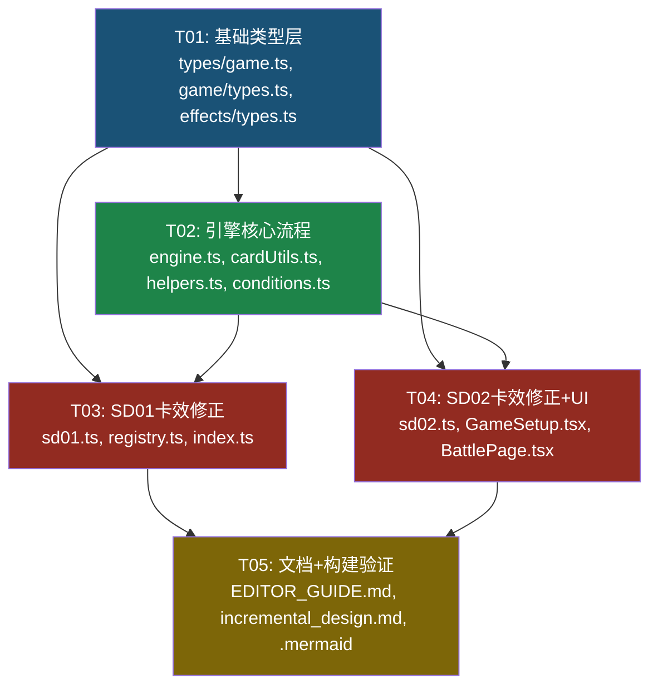

# 超英击战对战网站 — 增量架构设计

> 架构师：高见远 | 项目：超英击战 Marvel TCG 对战网站  
> 日期：2026-06-22 | 文档版本：v1.0  
> 基于：增量 PRD v1.0（产品经理许清楚）  
> 项目路径：`D:/WorkBuddyData/2026-06-12-03-21-19/marvel-tcg/`

---

## Part A: 系统设计

### 1. 实现方案与框架选型

#### 1.1 总体策略

在现有 Vite + React 18 + TypeScript + Tailwind CSS 架构基础上进行**增量修改**，不引入任何新框架或第三方库。所有变更遵循现有三大核心模式：

1. **Command-Reducer-Checkpoint 三层模式**：新增 GameAction → gameReducer 纯函数处理 → checkpoint 自动检查
2. **柯里化注入**：继续使用 `createGameReducer(db)` 闭包，不改变工厂签名
3. **效果注册系统**：新增/修正效果通过 `registerEffects` 注册到 `EFFECT_REGISTRY`，引擎通过 `triggerEffectsByTiming` 按时机触发

#### 1.2 核心技术挑战与方案

| 挑战 | 方案 |
|------|------|
| **应对阶段的状态机**：需要在号召完成后插入一个"双方轮流决策"的子流程，不能破坏现有 reducer 的线性执行 | 在 `handleSummonToField` / `handleSelectRetreat` 完成号召后设置 `pendingCounter` + `counterPassCount=0`，新增 3 个 handler 处理应对动作，通过 `counterPassCount` 判断连续不行动来结束应对窗口 |
| **连击的攻击次数追踪**：现有 `conflictAttackedCards: string[]` 是布尔标记，无法区分"已攻击1次"和"已攻击2次" | 新增 `conflictAttackCount: Record<string, number>`，在 `handleStartAttack` 和 `handleConfirmAttack` 中用攻击次数比对最大可攻击次数（有连击=2次，无=1次）。保留 `conflictAttackedCards` 向后兼容 |
| **强袭的战斗判定追加**：攻击战胜后需追加"破绽伤害"，这是在现有战斗判定流程中间插入的新逻辑 | 在 `handleConfirmAttack` 的"攻击者胜利"分支末尾，检查攻击者是否有【强袭】能力（通过 `temporaryAbilities` 或效果注册表），若有则执行冲击卡入时间线 |
| **空袭的目标选择**：需要允许跳过角色直接攻击破绽，这改变了攻击目标选择的约束 | 在 `handleConfirmAttack` 中，当 `targetCardId` 为 `undefined` 时，检查攻击者是否有【空袭】能力，若有则允许直接攻击破绽（即使敌方战区有角色） |
| **唯一性的号召检查**：号召时需检查同名牌，但"唯一"是卡牌属性而非效果 | 在 `handleSummonToField` 和 `handleSelectRetreat` 的号召验证阶段，通过效果注册表检查卡牌是否有 `isUnique` 标记，若有则遍历我方场上检查 `card.name` 是否已存在 |
| **"回合1次"效果的幂等追踪**：需要记录本回合哪些效果已使用，且不与"每回合重置"冲突 | 新增 `effectUsedThisTurn: string[]`，使用 `${cardNo}-${effectId}` 格式记录。`handleEndTurn` 中重置该数组 |
| **开局调度的洗牌问题**：引擎应为纯函数，但洗牌需要随机性 | 采用与现有 `SETUP_COMPLETE` 相同的模式：UI 层执行洗牌（`shuffleArray`），引擎处理确定性的状态转换。`MULLIGAN_CONFIRM` action 携带 UI 层已洗混的卡组顺序 |
| **staticModifier 幂等性**：`getEffectivePower` 每次调用 `staticModifier` 时返回新 ID 的 Modifier，虽然不会累加（直接读 value），但 ID 不稳定 | 修改 `staticModifier` 返回的 Modifier 使用确定性 ID：`static-${cardNo}-${effectId}`，替代 `genId()` |

#### 1.3 架构模式

保持现有模式不变：
- **前端**：React 函数组件 + useReducer（无 MVVM 框架）
- **引擎**：纯函数 reducer + 柯里化注入
- **效果系统**：注册表模式（Map<cardNo, CardEffect[]>）
- **不可变更新**：所有状态更新使用 `{...state}` 展开运算符

---

### 2. 文件列表

#### 新增文件

| 文件路径 | 说明 |
|---------|------|
| `docs/EDITOR_GUIDE.md` | 面向非技术项目经理的编辑指南 |
| `docs/incremental_design.md` | 本文档（增量架构设计） |
| `docs/sequence-diagram-incremental.mermaid` | 增量流程时序图 |
| `docs/class-diagram-incremental.mermaid` | 增量类图 |

#### 修改文件

| 文件路径 | 修改类型 | 说明 |
|---------|---------|------|
| `src/types/game.ts` | **类型扩展** | BattleState 新增 8 个字段；SetupPhase 扩展；PendingCounter 扩展 |
| `src/game/types.ts` | **类型扩展** | GameAction 新增 7 个 action 类型 |
| `src/game/effects/types.ts` | **类型扩展** | CardEffect 新增 3 个可选字段 |
| `src/game/engine.ts` | **核心修改** | 新增 7 个 handler；修改 4 个现有 handler |
| `src/game/cardUtils.ts` | **功能扩展** | 新增 `hasKeyword` 函数；修改 `getEffectivePower`/`getEffectiveR` 的 staticModifier ID 处理 |
| `src/game/events.ts` | **小修改** | 在 `createModifier` 调用后补充 `onStatChange` 事件触发 |
| `src/game/effects/helpers.ts` | **功能扩展** | 新增 `shuffleDeck`、`moveHandCardsToDeckBottom` 辅助函数 |
| `src/game/effects/conditions.ts` | **功能扩展** | 新增 `getMyFieldCards`、`checkUniqueName` 条件函数 |
| `src/game/effects/registry.ts` | **小修改** | 新增 `getActiveEffects`、`getEffectsByCategory` 查询函数 |
| `src/game/effects/sd01.ts` | **卡效修正** | 修正 12 张卡的实现（详见 PRD B-1） |
| `src/game/effects/sd02.ts` | **卡效修正** | 修正 12 张卡的实现（详见 PRD B-2） |
| `src/components/GameSetup.tsx` | **重构** | 重写 Step 3 调整手牌逻辑，实现选牌放回卡组底 |
| `src/pages/BattlePage.tsx` | **UI扩展** | 新增应对窗口 UI、起动效果按钮 UI |

---

### 3. 数据结构和接口变更

#### 3.1 类图（增量变更）

详见 `docs/class-diagram-incremental.mermaid`，此处为文字说明。

##### BattleState 新增字段

```typescript
// src/types/game.ts — BattleState 接口新增

/** 应对阶段：本回合双方是否已使用应对 [玩家0, 玩家1] */
counterUsedThisTurn: [boolean, boolean];

/** 应对阶段：连续不行动计数（双方各 pass 一次则计数=2，结束应对窗口） */
counterPassCount: number;

/** 连击追踪：本冲突阶段每张卡的已攻击次数 cardId → count */
conflictAttackCount: Record<string, number>;

/** 临时能力：本回合获得的关键词能力 cardId → ["combo"|"assault"|"airRaid"|"intercept"] */
temporaryAbilities: Record<string, string[]>;

/** 拦截使用追踪：本回合已使用拦截的卡 ID 列表 */
interceptUsedThisTurn: string[];

/** 效果使用追踪：本回合已使用的"回合1次"效果，格式 `${cardNo}-${effectId}` */
effectUsedThisTurn: string[];

/** 本回合已起动的效果列表，格式 `${cardNo}-${effectId}` */
activatedEffectsThisTurn: string[];

/** 开局调度：当前选中要放回卡组底的手牌 ID 列表 */
mulliganSelected: string[];
```

##### SetupPhase 扩展

```typescript
// src/types/game.ts — SetupPhase 类型扩展

export type SetupPhase =
  | "SHUFFLE"
  | "FIRST_PLAYER"
  | "DRAW_HANDS"      // 新增：已抽起始手牌
  | "MULLIGAN_P1"     // 新增：玩家1调整手牌中
  | "MULLIGAN_P2"     // 新增：玩家2调整手牌中
  | "DONE";           // 新增：准备完成
```

##### GameAction 新增类型

```typescript
// src/game/types.ts — GameAction 联合类型新增

/** 开局调度：抽起始手牌（设置 isSetup=true，进入 mulligan 阶段） */
| { type: "SETUP_DRAW_HANDS"; state: BattleState }

/** 开局调度：选择要调整的手牌（更新 mulliganSelected） */
| { type: "MULLIGAN_SELECT"; playerIdx: number; cardIds: string[] }

/** 开局调度：确认调整（放回卡组底 → 抽等量 → 洗混 → 进入下一玩家或开始游戏） */
| { type: "MULLIGAN_CONFIRM"; playerIdx: number; shuffledDeck: string[] }

/** 应对阶段：触发应对（使用手牌中【应对】角色进行号召） */
| { type: "TRIGGER_COUNTER"; playerIdx: number; cardId: string; handIndex: number }

/** 应对阶段：使用应对·起动效果（如拦截） */
| { type: "RESOLVE_COUNTER"; playerIdx: number; effectCardId: string; effectId?: string }

/** 应对阶段：选择不行动 */
| { type: "PASS_COUNTER"; playerIdx: number }

/** 起动效果：从手牌/基地/场上起动效果 */
| { type: "ACTIVATE_EFFECT"; playerIdx: number; cardId: string; effectId?: string }
```

##### CardEffect 新增字段

```typescript
// src/game/effects/types.ts — CardEffect 接口新增

/** 是否为应对·起动效果（区别于普通 active，如 SD01-002/016） */
isCounterActive?: boolean;

/** 是否拥有【唯一】关键词（号召时检查同名牌） */
isUnique?: boolean;

/** 常驻关键词能力列表（如 ["combo"] 表示拥有连击） */
keywords?: string[];
```

#### 3.2 关键接口函数（新增）

##### cardUtils.ts 新增

```typescript
/**
 * 检查卡牌是否拥有指定关键词能力
 * 检查来源：1. temporaryAbilities（本回合获得）2. 效果注册表中的 keywords 字段
 * @param state 游戏状态
 * @param cardId 卡牌 ID
 * @param keyword 关键词名称 ("combo"|"assault"|"airRaid"|"intercept"|"unique")
 * @param db 卡牌数据库
 * @returns 是否拥有该关键词
 */
export function hasKeyword(
  state: BattleState,
  cardId: string,
  keyword: string,
  db: CardDatabase
): boolean;
```

##### engine.ts 新增 handler 函数

```typescript
/** SETUP_DRAW_HANDS — 进入开局调度阶段 */
function handleSetupDrawHands(state: BattleState, actionState: BattleState): BattleState;

/** MULLIGAN_SELECT — 选择要调整的手牌 */
function handleMulliganSelect(state: BattleState, playerIdx: number, cardIds: string[]): BattleState;

/** MULLIGAN_CONFIRM — 确认调整，执行放回→抽牌→洗混 */
function handleMulliganConfirm(state: BattleState, playerIdx: number, shuffledDeck: string[]): BattleState;

/** TRIGGER_COUNTER — 触发应对（号召【应对】角色） */
function handleTriggerCounter(state: BattleState, playerIdx: number, cardId: string, handIndex: number): BattleState;

/** RESOLVE_COUNTER — 使用应对·起动效果 */
function handleResolveCounter(state: BattleState, playerIdx: number, effectCardId: string, effectId?: string): BattleState;

/** PASS_COUNTER — 选择不行动 */
function handlePassCounter(state: BattleState, playerIdx: number): BattleState;

/** ACTIVATE_EFFECT — 起动效果 */
function handleActivateEffect(state: BattleState, playerIdx: number, cardId: string, effectId?: string): BattleState;
```

##### helpers.ts 新增

```typescript
/** 洗混卡组（Fisher-Yates，非纯函数但与 GameSetup.tsx 中的 shuffleArray 一致） */
export function shuffleDeck(deck: string[]): string[];

/** 将手牌中指定卡牌放回卡组底，返回新状态 */
export function moveHandCardsToDeckBottom(
  state: BattleState,
  playerIdx: number,
  cardIds: string[]
): BattleState;
```

##### conditions.ts 新增

```typescript
/** 获取我方场上所有角色卡（不限特征） */
export function getMyFieldCards(
  state: BattleState,
  playerIdx: number
): { id: string; zone: Zone }[];

/** 检查我方场上是否已存在同名牌 */
export function hasDuplicateName(
  state: BattleState,
  playerIdx: number,
  cardName: string,
  db: CardDatabase,
  excludeCardId?: string
): boolean;
```

##### registry.ts 新增

```typescript
/** 获取某张卡的所有 active 类型效果（含应对·起动） */
export function getActiveEffects(cardNo: string): CardEffect[];

/** 获取某张卡的所有应对·起动效果 */
export function getCounterActiveEffects(cardNo: string): CardEffect[];
```

---

### 4. 程序调用流程

#### 4.1 开局调度流程（Mulligan）

```
GameSetup.tsx                      gameReducer                     checkpoint
     │                                  │                              │
     │  1. 洗牌+决先后手+抽6张           │                              │
     │  2. dispatch(SETUP_DRAW_HANDS,   │                              │
     │     {isSetup:true,               │                              │
     │      setupPhase:"MULLIGAN_P1"})  │                              │
     │─────────────────────────────────▶│                              │
     │                                  │  handleSetupDrawHands:       │
     │                                  │  return action.state         │
     │                                  │─────────────────────────────▶│
     │                                  │                              │
     │  3. UI 显示玩家1手牌选择界面      │                              │
     │  4. 玩家1选择要放回的牌           │                              │
     │  5. dispatch(MULLIGAN_SELECT,    │                              │
     │     playerIdx:0, cardIds:[...])  │                              │
     │─────────────────────────────────▶│                              │
     │                                  │  handleMulliganSelect:       │
     │                                  │  state.mulliganSelected =    │
     │                                  │    cardIds                   │
     │                                  │─────────────────────────────▶│
     │                                  │                              │
     │  6. 玩家1确认调整                 │                              │
     │  7. UI 执行洗牌 shuffleArray()    │                              │
     │  8. dispatch(MULLIGAN_CONFIRM,   │                              │
     │     playerIdx:0, shuffledDeck)   │                              │
     │─────────────────────────────────▶│                              │
     │                                  │  handleMulliganConfirm:      │
     │                                  │  - 从手牌移除 selected       │
     │                                  │  - 放入 shuffledDeck 为新卡组│
     │                                  │  - 从卡组顶抽等量牌          │
     │                                  │  - setupPhase → MULLIGAN_P2  │
     │                                  │  - mulliganSelected = []     │
     │                                  │─────────────────────────────▶│
     │                                  │                              │
     │  9. UI 显示玩家2手牌选择界面      │                              │
     │ 10. 玩家2选择+确认（同上流程）    │                              │
     │─────────────────────────────────▶│                              │
     │                                  │  handleMulliganConfirm:      │
     │                                  │  - 同上操作                  │
     │                                  │  - setupPhase → DONE         │
     │                                  │  - isSetup = false           │
     │                                  │  - turnPhase = TURN_START    │
     │                                  │─────────────────────────────▶│
     │                                  │                              │
     │ 11. 游戏正式开始                  │                              │
```

**快速开始模式**：`handleQuickStart` 直接 dispatch `SETUP_COMPLETE` with `isSetup: false`，跳过整个 mulligan 流程。

#### 4.2 应对阶段流程（Counter Phase）

```
玩家A号召                          gameReducer                     checkpoint
     │                                  │                              │
     │  dispatch(SUMMON_TO_FIELD)       │                              │
     │─────────────────────────────────▶│                              │
     │                                  │  handleSummonToField:        │
     │                                  │  - 执行号召（移手牌→场上）   │
     │                                  │  - 触发 onSummon 效果        │
     │                                  │  - 设置 pendingCounter = {   │
     │                                  │      summoningPlayerIdx: A,  │
     │                                  │      summoningCardId,        │
     │                                  │      summoningZone           │
     │                                  │    }                         │
     │                                  │  - counterPassCount = 0      │
     │                                  │─────────────────────────────▶│
     │                                  │                              │
     │  UI 检测 pendingCounter != null  │                              │
     │  检查玩家B手牌是否有【应对】角色  │                              │
     │                                  │                              │
     │  === 玩家B选择触发应对 ===        │                              │
     │  dispatch(TRIGGER_COUNTER,       │                              │
     │     playerIdx:B, cardId,         │                              │
     │     handIndex)                   │                              │
     │─────────────────────────────────▶│                              │
     │                                  │  handleTriggerCounter:       │
     │                                  │  - 验证 counterUsedThisTurn  │
     │                                  │  - 从手牌号召【应对】角色    │
     │                                  │  - counterUsedThisTurn[B]=true│
     │                                  │  - counterPassCount = 0      │
     │                                  │  - 保持 pendingCounter       │
     │                                  │  (应对号召也可能触发新的应对) │
     │                                  │─────────────────────────────▶│
     │                                  │                              │
     │  === 玩家B选择不行动 ===          │                              │
     │  dispatch(PASS_COUNTER, B)       │                              │
     │─────────────────────────────────▶│                              │
     │                                  │  handlePassCounter:          │
     │                                  │  - counterPassCount += 1     │
     │                                  │  - 若 counterPassCount >= 2: │
     │                                  │    pendingCounter = null     │
     │                                  │    (应对窗口结束)            │
     │                                  │─────────────────────────────▶│
     │                                  │                              │
     │  === 玩家A选择不行动 ===          │                              │
     │  dispatch(PASS_COUNTER, A)       │                              │
     │─────────────────────────────────▶│                              │
     │                                  │  handlePassCounter:          │
     │                                  │  - counterPassCount += 1     │
     │                                  │  - counterPassCount >= 2:    │
     │                                  │    pendingCounter = null     │
     │                                  │  (双方连续不行动，应对结束)  │
     │                                  │─────────────────────────────▶│
     │                                  │                              │
     │  继续原号召流程                   │                              │
```

**应对·起动效果**：玩家可选择 dispatch `RESOLVE_COUNTER` 而非 `TRIGGER_COUNTER`，引擎查找场上/手牌中的 `isCounterActive` 效果并执行（如拦截变更攻击目标）。

#### 4.3 起动效果触发流程（Activate Effect）

```
玩家点击起动按钮                    gameReducer                     checkpoint
     │                                  │                              │
     │  dispatch(ACTIVATE_EFFECT,       │                              │
     │     playerIdx, cardId, effectId) │                              │
     │─────────────────────────────────▶│                              │
     │                                  │  handleActivateEffect:       │
     │                                  │  1. 验证：活跃玩家 + ACTION  │
     │                                  │  2. 查找卡牌的 active 效果   │
     │                                  │     (getActiveEffects)       │
     │                                  │  3. 若指定 effectId 则过滤   │
     │                                  │  4. 检查 activeSource 与     │
     │                                  │     卡牌当前区域匹配         │
     │                                  │  5. 检查 effectUsedThisTurn  │
     │                                  │     (回合1次限制)            │
     │                                  │  6. 检查 condition + cost    │
     │                                  │  7. 执行 execute             │
     │                                  │  8. 若 faceDownAfterActive:  │
     │                                  │     将卡牌盖伏               │
     │                                  │  9. 若 once:                 │
     │                                  │     effectUsedThisTurn.push  │
     │                                  │ 10. activatedEffectsThisTurn │
     │                                  │     .push(effectId)          │
     │                                  │─────────────────────────────▶│
     │                                  │                              │
```

#### 4.4 连击攻击流程（Combo Attack）

```
冲突阶段                           gameReducer                     checkpoint
     │                                  │                              │
     │  dispatch(START_ATTACK, cardId)  │                              │
     │─────────────────────────────────▶│                              │
     │                                  │  handleStartAttack:          │
     │                                  │  - attackCount =             │
     │                                  │    conflictAttackCount[cardId]│
     │                                  │    ?? 0                      │
     │                                  │  - hasCombo = hasKeyword(    │
     │                                  │    state, cardId, "combo")   │
     │                                  │  - maxAttacks = hasCombo?2:1 │
     │                                  │  - if attackCount>=maxAttacks│
     │                                  │    return state (不能攻击)   │
     │                                  │  - 设置 pendingAttack        │
     │                                  │─────────────────────────────▶│
     │                                  │                              │
     │  dispatch(CONFIRM_ATTACK, target)│                              │
     │─────────────────────────────────▶│                              │
     │                                  │  handleConfirmAttack:        │
     │                                  │  - 执行战斗判定              │
     │                                  │  - conflictAttackCount[id]++ │
     │                                  │  - attackCount = 新值         │
     │                                  │  - hasCombo = hasKeyword()   │
     │                                  │  - maxAttacks = hasCombo?2:1 │
     │                                  │  - zoneComplete = every(     │
     │                                  │    card => count[card] >=    │
     │                                  │    maxAttacks(card))         │
     │                                  │  - 若 zoneComplete:          │
     │                                  │    conflictZonesCompleted    │
     │                                  │    .push(zone)               │
     │                                  │─────────────────────────────▶│
     │                                  │                              │
     │  UI 检测：该卡 attackCount < max │                              │
     │  → 可再次攻击（连击）             │                              │
     │  dispatch(START_ATTACK, cardId)  │                              │
     │─────────────────────────────────▶│                              │
     │                                  │  (第二次攻击，同上流程)       │
     │                                  │─────────────────────────────▶│
```

#### 4.5 强袭判定流程（Assault）

```
handleConfirmAttack 内部逻辑：

    ┌─────────────────────────────────┐
    │   角色对战：attPower > defPower  │
    │   (攻击者胜利)                   │
    └──────────────┬──────────────────┘
                   │
                   ▼
    ┌─────────────────────────────────┐
    │  防守者撤退                     │
    │  (现有逻辑)                     │
    └──────────────┬──────────────────┘
                   │
                   ▼
    ┌─────────────────────────────────┐
    │  hasAssault = hasKeyword(       │
    │    state, attackerCardId,       │
    │    "assault", db)               │
    └──────────────┬──────────────────┘
                   │
          ┌────────┴────────┐
          │                 │
     hasAssault=true   hasAssault=false
          │                 │
          ▼                 ▼
    ┌─────────────┐   ┌─────────────┐
    │ 强袭追加：   │   │ 正常结束    │
    │ 对方冲击卡组 │   │ (无追加)    │
    │ 顶1张入时间线│   │             │
    └─────────────┘   └─────────────┘
```

#### 4.6 唯一性检查流程（Unique Check）

```
handleSummonToField / handleSelectRetreat 内部：

    ┌─────────────────────────────────┐
    │  玩家发起号召 cardId            │
    └──────────────┬──────────────────┘
                   │
                   ▼
    ┌─────────────────────────────────┐
    │  card = db.cards.find(cardId)   │
    │  effects = getEffectsByCardNo(  │
    │    card.card_no)                │
    │  isUnique = effects.some(       │
    │    e => e.isUnique)             │
    └──────────────┬──────────────────┘
                   │
          ┌────────┴────────┐
          │                 │
     isUnique=true     isUnique=false
          │                 │
          ▼                 ▼
    ┌─────────────┐   ┌─────────────┐
    │ 遍历我方场上 │   │ 正常号召    │
    │ 检查同名牌   │   │             │
    │ (card.name) │   │             │
    └──────┬──────┘   └─────────────┘
           │
    ┌──────┴──────┐
    │             │
  有同名牌     无同名牌
    │             │
    ▼             ▼
┌─────────┐  ┌─────────┐
│ 阻止号召 │  │ 正常号召 │
│ 返回提示 │  │         │
└─────────┘  └─────────┘
```

---

### 5. 待明确事项

| # | 问题 | 影响 | 当前假设 | 需确认方 |
|---|------|------|---------|---------|
| Q1 | SD01-009 "同Lv角色"的"同Lv"指此卡Lv还是基地盖卡Lv？ | SD01-009 卡效 | 假设指此卡(反浩克装甲)的Lv | 产品/规则 |
| Q2 | SD02-018 "R=1"指基础R还是有效R（含修改器）？ | SD02-018 卡效 | 假设指基础R值（当前实现保持不变） | 产品/规则 |
| Q3 | SD02-005 "舍弃卡组顶3张"的去向是撤退区还是虚空区？ | SD02-005 卡效 | 当前 `millDeck` 仅从卡组移除未指定去向，假设入撤退区 | 产品/规则 |
| Q4 | "应对·起动"效果仅在应对步骤可用，还是行动阶段也可作为普通起动效果？ | 引擎流程 | 假设仅应对步骤可用（`RESOLVE_COUNTER` 专用），行动阶段用 `ACTIVATE_EFFECT` | 产品/规则 |
| Q5 | "回合1次"限制是按回合（双方各算1次）还是按自己回合？ | 多张卡 | 假设"每回合双方各自最多1次"（即 `effectUsedThisTurn` 在每回合结束时清空，双方各自独立） | 产品/规则 |
| Q6 | "本回合获得"的关键词能力（如SD02-016获得【强袭】）：若此卡在本回合撤退，能力是否消失？ | 临时能力追踪 | 假设撤退后能力消失（`temporaryAbilities` 在 `retreatCard` 时清除该卡的条目） | 产品/规则 |
| Q7 | 目标选择 UI（P1-1）是否在本期实现？ | UI层 | 本期实现基础版（弹窗选目标），完整版可延后 | 产品 |
| Q8 | 开局调度中 `MULLIGAN_CONFIRM` 携带 `shuffledDeck` 参数是否破坏纯函数原则？ | 引擎架构 | 接受此设计：UI 层执行洗牌（与现有 `SETUP_COMPLETE` 模式一致），引擎处理确定性状态转换。严格来说 `gameReducer` 不是数学纯函数，但与现有架构保持一致 | 架构 |
| Q9 | `conflictAttackedCards` 是否完全替换为 `conflictAttackCount`？ | 引擎 | 保留两者：`conflictAttackedCards` 向后兼容（其他逻辑可能引用），`conflictAttackCount` 为连击判断的主数据源 | 架构 |
| Q10 | SD01-004 "敌方战斗阶段"中的"敌方"是指当前回合玩家的对方，还是固定指引擎中的"对方玩家"？ | SD01-004 卡效 | 假设指"当前回合玩家的对方"——即此卡在玩家A场上时，仅当玩家B的冲突阶段才生效。condition 增加 `state.activePlayerIndex !== ctx.playerIdx` 检查 | 产品/规则 |

---

## Part B: 任务分解

### 6. 依赖包列表

**无新增第三方包。** 所有增量需求均在现有技术栈（Vite + React 18 + TypeScript + Tailwind CSS）内实现，不引入新框架或库。

---

### 7. 任务列表（按依赖顺序）

#### T01: 基础类型层 — 状态/动作/效果类型扩展

| 项 | 值 |
|---|---|
| **Task ID** | T01 |
| **任务名** | 基础类型层：BattleState/GameAction/CardEffect 类型扩展 |
| **源文件** | `src/types/game.ts`, `src/game/types.ts`, `src/game/effects/types.ts` |
| **依赖** | 无 |
| **优先级** | P0 |

**任务描述：**

扩展所有 TypeScript 类型定义，为后续引擎和卡效修改提供类型基础。

1. `src/types/game.ts`：
   - `BattleState` 新增 8 个字段：`counterUsedThisTurn`, `counterPassCount`, `conflictAttackCount`, `temporaryAbilities`, `interceptUsedThisTurn`, `effectUsedThisTurn`, `activatedEffectsThisTurn`, `mulliganSelected`
   - `SetupPhase` 扩展为 6 个值：`"SHUFFLE" | "FIRST_PLAYER" | "DRAW_HANDS" | "MULLIGAN_P1" | "MULLIGAN_P2" | "DONE"`

2. `src/game/types.ts`：
   - `GameAction` 联合类型新增 7 个 action：`SETUP_DRAW_HANDS`, `MULLIGAN_SELECT`, `MULLIGAN_CONFIRM`, `TRIGGER_COUNTER`, `RESOLVE_COUNTER`, `PASS_COUNTER`, `ACTIVATE_EFFECT`

3. `src/game/effects/types.ts`：
   - `CardEffect` 接口新增 3 个可选字段：`isCounterActive?: boolean`, `isUnique?: boolean`, `keywords?: string[]`

**验收标准：**
- [ ] TypeScript 编译 0 错误（`npm run build` 通过）
- [ ] 所有新增字段为可选或有默认值，不破坏现有 BattleState 初始化
- [ ] GameAction 联合类型正确扩展，switch 语句需后续在 T02 中补全 default 分支

---

#### T02: 引擎核心 — 开局调度/应对阶段/起动效果/关键词能力 + 辅助函数

| 项 | 值 |
|---|---|
| **Task ID** | T02 |
| **任务名** | 引擎核心流程补全 + 辅助函数扩展 |
| **源文件** | `src/game/engine.ts`, `src/game/cardUtils.ts`, `src/game/effects/helpers.ts`, `src/game/effects/conditions.ts` |
| **依赖** | T01 |
| **优先级** | P0 |

**任务描述：**

在引擎中实现所有新增 handler，修改现有 handler 以支持关键词能力，并扩展辅助函数。

1. `src/game/engine.ts`：
   - **新增 7 个 handler**：
     - `handleSetupDrawHands` — 进入开局调度阶段
     - `handleMulliganSelect` — 更新 `mulliganSelected`
     - `handleMulliganConfirm` — 执行放回卡组底→抽等量→洗混→推进阶段
     - `handleTriggerCounter` — 触发应对（号召【应对】角色）
     - `handleResolveCounter` — 使用应对·起动效果
     - `handlePassCounter` — 不行动，检查连续不行动
     - `handleActivateEffect` — 起动效果（验证→查注册表→检查condition/cost→执行→faceDown→once标记）
   - **修改 4 个现有 handler**：
     - `handleSummonToField` — 新增唯一性检查；号召完成后设置 `pendingCounter` + `counterPassCount=0`
     - `handleSelectRetreat` — 同上，Lv4+号召完成后设置 `pendingCounter`
     - `handleConfirmAttack` — 新增连击攻击次数追踪(`conflictAttackCount`)；强袭判定(攻击战胜→追加破绽伤害)；空袭判定(允许跳过角色攻击破绽)
     - `handleEndTurn` — 重置所有新增回合计数器：`counterUsedThisTurn`, `counterPassCount`, `conflictAttackCount`, `temporaryAbilities`, `interceptUsedThisTurn`, `effectUsedThisTurn`, `activatedEffectsThisTurn`
   - **修改 `handleStartAttack`**：用 `conflictAttackCount` 替代 `conflictAttackedCards` 判断是否可攻击（有连击=2次，无=1次）
   - 在 switch 语句中添加 7 个新 case

2. `src/game/cardUtils.ts`：
   - 新增 `hasKeyword(state, cardId, keyword, db)` 函数：检查 `temporaryAbilities` + 效果注册表 `keywords` 字段
   - 修改 `getEffectivePower` / `getEffectiveR` 中的 `staticModifier` 调用：确保不会因新 ID 导致重复累加（当前实现已安全，但添加注释说明）

3. `src/game/effects/helpers.ts`：
   - 新增 `shuffleDeck(deck)` — Fisher-Yates 洗牌
   - 新增 `moveHandCardsToDeckBottom(state, playerIdx, cardIds)` — 将指定手牌移至卡组底
   - 修改 `retreatCard` — 撤退时清除 `temporaryAbilities[cardId]`

4. `src/game/effects/conditions.ts`：
   - 新增 `getMyFieldCards(state, playerIdx)` — 获取我方场上所有角色卡（不限特征）
   - 新增 `hasDuplicateName(state, playerIdx, cardName, db, excludeCardId?)` — 检查同名牌

**验收标准：**
- [ ] 所有新增 handler 在 switch 中正确路由
- [ ] `handleSummonToField` 号召完成后设置 `pendingCounter`
- [ ] `handleConfirmAttack` 正确追踪 `conflictAttackCount`，连击角色可攻击2次
- [ ] `handleConfirmAttack` 攻击者胜利时检查强袭，追加破绽伤害
- [ ] `handleConfirmAttack` 允许空袭角色跳过角色攻击破绽
- [ ] `handleEndTurn` 重置所有新增计数器
- [ ] `handleActivateEffect` 正确验证、执行、标记起动效果
- [ ] 唯一性检查在号召时生效
- [ ] TypeScript 编译 0 错误

---

#### T03: SD01 卡效修正 + 效果注册表扩展

| 项 | 值 |
|---|---|
| **Task ID** | T03 |
| **任务名** | SD01 全部19张卡效逐张核对修正 + 注册表查询函数 |
| **源文件** | `src/game/effects/sd01.ts`, `src/game/effects/registry.ts`, `src/game/effects/index.ts` |
| **依赖** | T01, T02 |
| **优先级** | P0 |

**任务描述：**

逐张修正 SD01 卡效实现，并扩展效果注册表的查询能力。

1. `src/game/effects/sd01.ts` — 按PRD B-1核对清单逐张修正：

   | 卡号 | 修正内容 |
   |------|---------|
   | SD01-001 | 新增 `once: true`；改为选发效果（condition 中返回 `state.pendingCounter == null`，引擎不自动触发） |
   | SD01-002 | `isCounterActive: true`；`once: true`；修正撤退逻辑为"1张其他结附卡"（当前为所有） |
   | SD01-003 | `once: true`；在 `createModifier` 后触发 `onStatChange` 事件 |
   | SD01-004 | condition 增加 `state.activePlayerIndex !== ctx.playerIdx`（敌方回合检查）；`staticModifier` 使用确定性 ID `static-SD01-004-0` |
   | SD01-005 | 增加区域条件标注（trigger 区域为"场上"） |
   | SD01-006 | 保持现有实现（选发目标选择为 P1） |
   | SD01-007 | 改为选发效果（增加 `triggerCondition` 返回 true 但引擎层面需选发确认） |
   | SD01-008 | 修正 condition：`getOpponentFieldCardsWithMinLv` 用于检查我方是错误的，改为遍历我方场上检查 Lv4+；`staticModifier` 不再硬编码 false |
   | SD01-009 | 确认"同Lv"指此卡Lv（保持现有实现）；补充基地盖卡展示日志 |
   | SD01-010 | 无需修正 |
   | SD01-011 | 待 T02 应对流程接入后，修正 execute 为按应对规则处理（非简单取消号召） |
   | SD01-014 | 改为选发效果 |
   | SD01-015 | 保持现有实现（"可"选发为 P1） |
   | SD01-016 | `isCounterActive: true`；`once: true`；修正 `activeSource` 为 `"field"` |
   | SD01-017 | `keywords: ["combo"]`；`staticModifier` 返回 null（连击通过 `hasKeyword` 检查，不通过 Modifier） |
   | SD01-018 | 改为选发效果 |

2. `src/game/effects/registry.ts`：
   - 新增 `getActiveEffects(cardNo)` — 获取所有 active 类型效果（含 `isCounterActive`）
   - 新增 `getCounterActiveEffects(cardNo)` — 获取所有应对·起动效果

3. `src/game/effects/index.ts`：
   - 导出新增的 registry 查询函数

**验收标准：**
- [ ] SD01 所有19张卡逐张核对完毕，每张有核对结论
- [ ] SD01-002/016 正确标记 `isCounterActive: true`
- [ ] SD01-017 正确标记 `keywords: ["combo"]`
- [ ] SD01-004 condition 增加敌方回合检查
   - [ ] SD01-008 condition 逻辑修正
   - [ ] SD01-017 `staticModifier` 不再返回 null（改为通过 keywords 标记）
   - [ ] 9张"回合1次"卡正确标记 `once: true`
   - [ ] staticModifier 使用确定性 ID
   - [ ] TypeScript 编译 0 错误

---

#### T04: SD02 卡效修正 + UI 层适配

| 项 | 值 |
|---|---|
| **Task ID** | T04 |
| **任务名** | SD02 全部19张卡效修正 + GameSetup 重构 + BattlePage 应对/起动 UI |
| **源文件** | `src/game/effects/sd02.ts`, `src/components/GameSetup.tsx`, `src/pages/BattlePage.tsx` |
| **依赖** | T01, T02 |
| **优先级** | P0 |

**任务描述：**

逐张修正 SD02 卡效实现，重构开局调度 UI，扩展对战页面 UI。

1. `src/game/effects/sd02.ts` — 按PRD B-2核对清单逐张修正：

   | 卡号 | 修正内容 |
   |------|---------|
   | SD02-001 | `isUnique: true`；`staticModifier` 使用确定性 ID；第二个效果注释说明需多目标修改器（当前仅自身） |
   | SD02-002 | `isUnique: true` |
   | SD02-003 | 实现"不因相杀撤退"逻辑（通过 `keywords: ["antiMutualKill"]` 标记，引擎在平局分支检查）；`staticModifier` 使用确定性 ID |
   | SD02-004 | 待 T02 应对流程接入后修正 execute |
   | SD02-005 | `once: true`；`faceDownAfterActive: true`；`millDeck` 修改为入撤退区 |
   | SD02-006 | 改为选发；`once: true`（起动效果）；增加 Lv1 过滤 |
   | SD02-007 | 保持现有实现（目标选择为 P1） |
   | SD02-008 | `once: true`；`faceDownAfterActive: true` |
   | SD02-009 | `once: true`；`faceDownAfterActive: true` |
   | SD02-010 | 改为选发 |
   | SD02-011 | `once: true` |
   | SD02-014 | 确认 `triggerInfo` 在 `onAttack` 时传递攻击目标 |
   | SD02-015 | 改为选发 |
   | SD02-016 | 修改 execute：设置 `temporaryAbilities[cardId] = ["assault"]` |
   | SD02-017 | 改为选发 |
   | SD02-018 | 保持使用基础R值（假设Q2确认） |

2. `src/components/GameSetup.tsx`：
   - **重构 Step 3（调整手牌）**：
     - 显示先攻玩家手牌（可点击选择/取消选择）
     - 选中的牌高亮显示
     - "确认调整"按钮：将选中牌放回卡组底→UI 执行洗牌→dispatch `MULLIGAN_CONFIRM`
     - "不调整"按钮：直接 dispatch `MULLIGAN_CONFIRM`（空选中列表）
     - 先攻玩家完成后切换到后攻玩家
   - 修改 `confirmMulligan` → 改为 dispatch `SETUP_DRAW_HANDS`（设置 `isSetup: true`）
   - 修改 `handleQuickStart` 保持不变（直接 `SETUP_COMPLETE` with `isSetup: false`）
   - 新增 `mulliganSelected` 本地状态管理

3. `src/pages/BattlePage.tsx`：
   - **应对窗口 UI**：检测 `state.pendingCounter != null` 时，显示应对提示面板
     - 高亮手牌中拥有【应对】角色（通过 `getCounterEffects` 查询）
     - "触发应对"按钮 → dispatch `TRIGGER_COUNTER`
     - "使用应对·起动"按钮 → dispatch `RESOLVE_COUNTER`（如有可用效果）
     - "不行动"按钮 → dispatch `PASS_COUNTER`
   - **起动效果按钮 UI**：在 ACTION 阶段，检测手牌/基地/场上卡牌是否有 active 效果
     - 可起动的卡牌高亮显示
     - 点击 → dispatch `ACTIVATE_EFFECT`
   - **连击提示**：检测 `conflictAttackCount[cardId] < 2 && hasKeyword(cardId, "combo")` 时，显示"可连击"标记

**验收标准：**
- [ ] SD02 所有19张卡逐张核对完毕
- [ ] SD02-001/002 正确标记 `isUnique: true`
- [ ] SD02-016 正确设置 `temporaryAbilities`
- [ ] SD02-005/008/009 正确设置 `once: true` 和 `faceDownAfterActive: true`
- [ ] GameSetup Step 3 可选择具体手牌放回卡组底
- [ ] 先攻玩家先行调整，后攻玩家再调整
- [ ] 调整后洗混卡组
- [ ] BattlePage 显示应对窗口
- [ ] BattlePage 显示起动效果按钮
- [ ] 快速开始模式仍可用
- [ ] TypeScript 编译 0 错误

---

#### T05: 编辑指南 + 设计文档 + 构建验证

| 项 | 值 |
|---|---|
| **Task ID** | T05 |
| **任务名** | 编辑指南文档 + 增量设计文档 + 时序图/类图 + 构建验证 |
| **源文件** | `docs/EDITOR_GUIDE.md`, `docs/incremental_design.md`, `docs/sequence-diagram-incremental.mermaid`, `docs/class-diagram-incremental.mermaid` |
| **依赖** | T01, T02, T03, T04 |
| **优先级** | P0 |

**任务描述：**

创建面向非技术项目经理的编辑指南，完善增量设计文档和图表，执行最终构建验证。

1. `docs/EDITOR_GUIDE.md`：
   - 项目整体结构说明（目录树 + 可编辑文件标注）
   - 卡牌数据编辑指南（cards.json 字段说明 + 新增卡牌 step-by-step）
   - 新卡效撰写指南（分类说明 + 模板 + 2个完整示例）
   - 各功能板块编辑入口（页面文案/导航/帮助/设置/图片/预组卡组）
   - 常见操作 FAQ（≥10个问题）

2. `docs/incremental_design.md`：
   - 本文档（增量架构设计）

3. `docs/sequence-diagram-incremental.mermaid`：
   - 开局调度流程时序图
   - 应对阶段流程时序图
   - 起动效果触发流程时序图

4. `docs/class-diagram-incremental.mermaid`：
   - 增量类图（BattleState 新字段、GameAction 新类型、CardEffect 新字段、新增函数）

5. **构建验证**：
   - 执行 `npm run build` 确认 0 错误
   - 执行 `npm run dev` 确认开发服务器正常启动
   - 手动测试关键流程：开局调度→应对→连击→强袭→起动效果

**验收标准：**
- [ ] EDITOR_GUIDE.md 语言通俗易懂，无未解释的代码术语
- [ ] 包含完整项目目录结构图
- [ ] cards.json 每个字段有说明和示例
- [ ] 新增卡牌有 step-by-step 操作步骤
- [ ] 新卡效撰写有模板和至少2个完整示例
- [ ] FAQ 覆盖至少10个常见问题
- [ ] 增量设计文档包含所有8个章节
- [ ] 时序图覆盖3个关键流程
- [ ] 类图覆盖所有新增类型和字段
- [ ] `npm run build` 0 错误

---

### 8. 共享知识

#### 8.1 效果ID命名规范

```
格式：${cardNo}-${effectIndex}
示例：SD01-001-0, SD01-002-0, SD01-002-1 (一张卡多个效果用 -0, -1, -2 区分)
```

#### 8.2 "回合1次"追踪机制

```
字段：effectUsedThisTurn: string[]
格式：${cardNo}-${effectId}
示例：["SD01-001-SD01-001-0", "SD02-005-SD02-005-0"]

重置时机：handleEndTurn 中清空 effectUsedThisTurn = []
检查时机：handleActivateEffect 和 triggerEffectsByTiming 中，若 effect.once === true，
         检查 effectUsedThisTurn 是否包含该 effect.id
```

#### 8.3 关键词能力检查机制

```typescript
// hasKeyword(state, cardId, keyword, db) 检查顺序：
// 1. temporaryAbilities[cardId] — 本回合获得的能力（如 SD02-016 获得【强袭】）
// 2. 效果注册表中 effect.keywords 字段 — 常驻关键词（如 SD01-017 条件获得【连击】）
//    对于条件关键词，还需检查 effect.condition 是否满足

// 关键词名称统一使用英文：
// "combo" = 连击, "assault" = 强袭, "airRaid" = 空袭,
// "intercept" = 拦截, "unique" = 唯一, "counter" = 应对
```

#### 8.4 应对阶段状态约定

```
pendingCounter != null → 应对窗口开启
counterPassCount:
  0 = 刚开启窗口，无人 pass
  1 = 一方已 pass
  2 = 双方连续 pass → 关闭窗口 (pendingCounter = null)

counterUsedThisTurn[playerIdx]:
  false = 本回合尚未使用应对
  true = 本回合已使用应对（不可再次 TRIGGER_COUNTER）

应对窗口在以下情况开启：
  - handleSummonToField 完成号召后
  - handleSelectRetreat 完成号召后

应对窗口在以下情况关闭：
  - counterPassCount >= 2（双方连续不行动）
  - 游戏进入非 ACTION 阶段
  - 回合结束（handleEndTurn）
```

#### 8.5 不可变更新约定

```
所有状态更新必须使用展开运算符：
  ✅ { ...state, field: newValue }
  ✅ { ...state, players: [...state.players] as typeof state.players }
  ❌ state.field = newValue
  ❌ state.players[0].hand.push(cardId)

修改器使用确定性 ID（修复幂等性问题）：
  ✅ id: `static-${effect.cardNo}-${effect.id}`
  ❌ id: genId() // 每次生成不同 ID
```

#### 8.6 开局调度与引擎的交互约定

```
SETUP_COMPLETE 仍可用于快速开始（isSetup: false, 跳过 mulligan）
SETUP_DRAW_HANDS 用于正式开局（isSetup: true, 进入 mulligan 阶段）
MULLIGAN_CONFIRM 携带 shuffledDeck 参数（UI 层已洗混的卡组顺序）
  → 这与 SETUP_COMPLETE 携带完整 state 的模式一致
  → 引擎本身不执行洗牌（保持与现有架构一致）
```

#### 8.7 BattleState 初始化约定

所有新增字段在 `GameSetup.tsx` 的 `makePlayer` / `confirmMulligan` / `handleQuickStart` / `autoStart` 中初始化：

```typescript
counterUsedThisTurn: [false, false],
counterPassCount: 0,
conflictAttackCount: {},
temporaryAbilities: {},
interceptUsedThisTurn: [],
effectUsedThisTurn: [],
activatedEffectsThisTurn: [],
mulliganSelected: [],
```

---

### 9. 任务依赖图



**关键路径**：T01 → T02 → T03/T04(并行) → T05  
**预估工作量**：T01(0.5天) + T02(3天) + T03(2天) + T04(2.5天) + T05(1天) = **约9个工作日**
