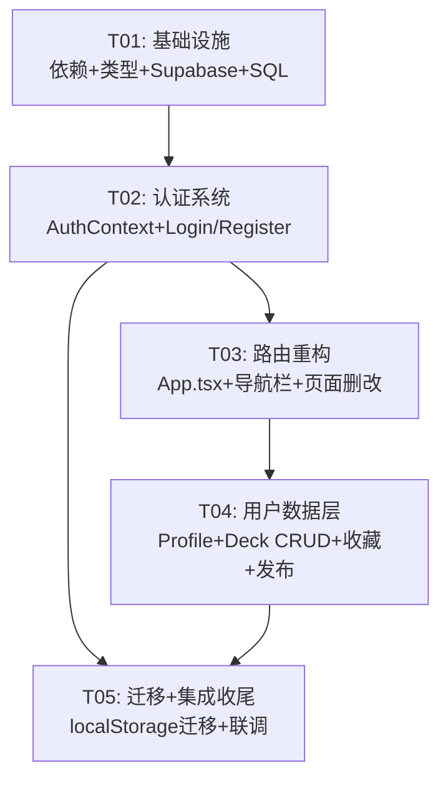

# 斗界竞技场 — 用户系统架构设计 + 任务分解

> **作者**: Bob (Architect)  
> **日期**: 2026-06-16  
> **版本**: v1.0（P0 MVP）

---

## Part A: 系统设计

---

### 1. 实现方案

#### 1.1 核心技术挑战

| 挑战 | 分析 | 方案 |
|------|------|------|
| **Auth 集成** | 需要邮箱注册/登录/登出，无后端 | Supabase Auth（免费 5 万 MAU），客户端 SDK 搞定 |
| **路由改造** | 当前无路由库，用 `tab` 状态模拟 | 引入 `react-router-dom v6`，同时保留 URL hash 分享卡组兼容 |
| **状态提升** | App.tsx 是巨型单体组件（~320 行），所有状态在顶层 | 用 Context 拆 Auth 状态，用 custom hooks 拆数据逻辑，App.tsx 瘦身为路由壳 |
| **旧数据迁移** | localStorage 卡组需导入到 Supabase | 登录后自动检测 localStorage 数据 → 弹窗确认 → 批量导入 |
| **头像上传** | 需要存储头像图片 | Supabase Storage（免费 1GB） + 公开 bucket RLS 策略 |

#### 1.2 框架与库选型

| 类别 | 选型 | 版本 | 理由 |
|------|------|------|------|
| BaaS | **Supabase** | `@supabase/supabase-js@^2` | Auth + DB + Storage 一站式，免费额度充足，开源 |
| 路由 | **react-router-dom** | `^6` | React 生态标准，支持 HashRouter 兼容现有 URL hash 机制 |
| 状态管理 | **React Context** | 内置 | 当前项目无状态库，Context 对 Auth 场景足够，避免引入额外学习成本 |
| 表单验证 | 手工实现 | — | MVP 阶段避免引入 formik/react-hook-form，保持轻量 |
| 头像裁剪 | 无额外库 | — | 直接用 `<input type="file">` + `` 预览，Supabase Storage 直接上传原图（后续 P1 加裁剪） |

#### 1.3 架构模式

采用 **Context + Custom Hooks** 模式（轻量版 MVVM）：

```
┌─────────────────────────────────────────┐
│  main.tsx  ──  包裹 Provider 壳          │
│  ├─ AuthProvider                        │
│  │   └─ BrowserRouter                   │
│  │       └─ App (Routes)                │
│  └─                                    │
│  AuthContext: { user, session, ... }    │
│  所有子组件通过 useAuth() hook 消费      │
└─────────────────────────────────────────┘
```

- **不引入全局 store**（Redux/Zustand 都太重），Supabase client 自身就是"reactive cache"
- **Service 层** 封装 Supabase 调用，与 UI 隔离，便于测试

---

### 2. 文件列表

```
项目根目录: D:\WorkBuddyData\2026-06-12-03-21-19\marvel-tcg/

── .env                                  [NEW]     环境变量（Supabase 连接）
── .env.example                          [NEW]     环境变量模板
── package.json                          [MODIFY]  新增依赖
── src/
│   ├── vite-env.d.ts                    [MODIFY]  添加 ImportMetaEnv 类型
│   ├── main.tsx                         [MODIFY]  包裹 AuthProvider + BrowserRouter
│   ├── App.tsx                          [MODIFY]  重构为路由壳 + 导航栏改造
│   ├── index.css                        [MODIFY]  新增 Auth/User 相关样式
│   │
│   ├── lib/
│   │   └── supabase.ts                  [NEW]     Supabase client 单例
│   │
│   ├── types/
│   │   ├── card.ts                      [MODIFY]  Deck 类型扩展（id/user_id/description/is_published）
│   │   ├── user.ts                      [NEW]     Auth 相关类型
│   │   └── database.ts                  [NEW]     Supabase 表行类型
│   │
│   ├── contexts/
│   │   └── AuthContext.tsx              [NEW]     Auth 状态 Provider
│   │
│   ├── hooks/
│   │   ├── useAuth.ts                   [NEW]     封装 useContext(AuthContext)
│   │   ├── useProfile.ts               [NEW]     个人资料 CRUD
│   │   ├── useDecks.ts                  [NEW]     卡组云端 CRUD
│   │   └── useFavorites.ts             [NEW]     收藏 CRUD
│   │
│   ├── services/
│   │   ├── authService.ts              [NEW]     Supabase Auth 调用封装
│   │   ├── userService.ts              [NEW]     users 表 CRUD
│   │   ├── deckService.ts              [NEW]     decks 表 CRUD
│   │   └── favoriteService.ts          [NEW]     favorites 表 CRUD
│   │
│   ├── components/
│   │   ├── AuthModal.tsx                [NEW]     登录/注册模态框
│   │   ├── UserMenu.tsx                [NEW]     右上角用户头像+下拉菜单
│   │   ├── ProfileEditor.tsx           [NEW]     个人资料编辑表单
│   │   ├── AvatarUpload.tsx            [NEW]     头像上传组件
│   │   └── PublishDeckModal.tsx        [NEW]     发布卡组到广场弹窗
│   │
│   ├── pages/
│   │   ├── AuthPage.tsx                [NEW]     登录/注册独立页面
│   │   ├── ProfilePage.tsx             [NEW]     个人资料展示/编辑页
│   │   ├── CardSearchPage.tsx          [DELETE]  移除卡牌查询页
│   │   ├── AboutPage.tsx               [DELETE]  移除关于页
│   │   ├── WelcomePage.tsx             [MODIFY]  加入登录CTA入口
│   │   ├── DeckPlazaPage.tsx           [MODIFY]  集成远程已发布卡组+收藏
│   │   ├── DeckBuilderPage.tsx         [MODIFY]  添加"发布到广场"按钮
│   │   ├── BattlePage.tsx              [MODIFY]  适配新路由传参
│   │   ├── ChatPage.tsx                [MODIFY]  适配新路由传参
│   │   ├── HelpPage.tsx                [MODIFY]  适配新路由传参
│   │   └── SettingsPage.tsx            [MODIFY]  适配新路由传参
│   │
│   └── utils/
│       ├── deckCode.ts                  [EXISTING] 不变
│       └── migration.ts                [NEW]     localStorage → Supabase 迁移
│
└── supabase/
    └── migrations/
        └── 001_initial_schema.sql       [NEW]     建表 + RLS 策略
```

**文件统计**：
- **NEW**: 20 个文件
- **MODIFY**: 11 个文件
- **DELETE**: 2 个文件
- **总计**: 33 个文件变更

---

### 3. 数据结构和接口

#### 3.1 TypeScript 类型定义

```typescript
// ═══════════════════════════════════════════════
// src/types/user.ts (NEW)
// ═══════════════════════════════════════════════

/** AuthContext 暴露的认证状态 */
export interface AuthState {
  user: AuthUser | null;
  session: Session | null;
  isLoading: boolean;
  isAuthenticated: boolean;
}

/** 前端使用的用户对象 */
export interface AuthUser {
  id: string;           // Supabase auth.uid()
  email: string;
  nickname: string;     // 来自 users 表
  avatar_url: string | null;
  bio: string;
  created_at: string;
}

/** 个人资料编辑表单 */
export interface ProfileFormData {
  nickname: string;
  bio: string;
  avatarFile: File | null;
}

// ═══════════════════════════════════════════════
// src/types/database.ts (NEW) — Supabase 行类型
// ═══════════════════════════════════════════════

export interface UserRow {
  id: string;
  email: string;
  nickname: string;
  avatar_url: string | null;
  bio: string;
  created_at: string;
}

export interface DeckRow {
  id: string;
  user_id: string;
  title: string;
  description: string;
  cards_json: string;     // JSON.stringify(DeckEntry[])
  is_published: boolean;
  created_at: string;
  updated_at: string;
}

export interface FavoriteRow {
  id: string;
  user_id: string;
  deck_id: string;
  created_at: string;
}

// P1
export interface BattleRecordRow {
  id: string;
  winner_id: string;
  loser_id: string;
  rounds: number;
  battle_at: string;
}

export interface SeasonRankingRow {
  id: string;
  user_id: string;
  season_id: string;
  score: number;
  wins: number;
  losses: number;
  draws: number;
}

export interface CommentRow {
  id: string;
  user_id: string;
  deck_id: string;
  content: string;
  created_at: string;
}

// P2
export interface FollowRow {
  id: string;
  follower_id: string;
  followee_id: string;
  created_at: string;
}

export interface NotificationRow {
  id: string;
  user_id: string;
  type: string;
  content: string;
  is_read: boolean;
  created_at: string;
}

// ═══════════════════════════════════════════════
// src/types/card.ts (MODIFY — 扩展 Deck)
// ═══════════════════════════════════════════════

export interface Deck {
  id?: string;             // [NEW] Supabase deck id，localStorage 卡组无此字段
  user_id?: string;        // [NEW] 所属用户 id
  name: string;
  main_deck: DeckEntry[];
  rush_deck: DeckEntry[];
  created_at: string;
  description?: string;    // [NEW] 卡组描述
  is_published?: boolean;  // [NEW] 是否已发布到广场
  // 以下为联表查询的填充字段（不在数据库存储）
  author_nickname?: string;   // 作者昵称（广场展示用）
  author_avatar_url?: string; // 作者头像URL
  favorite_count?: number;    // 收藏数
  is_favorited?: boolean;     // 当前用户是否已收藏
}
```

#### 3.2 类图（Mermaid）

详见 `docs/class-diagram.mermaid`，核心关系：

```
AuthContext (Provider)
  ├── useAuth() → AuthState { user, session, isLoading }
  ├── authService: { signUp(), signIn(), signOut(), getSession() }
  └── userService: { getProfile(), updateProfile(), uploadAvatar() }

DeckPage (消费端)
  ├── useDecks() → { publishedDecks, myDecks, publishDeck(), deleteDeck() }
  ├── useFavorites() → { favorites, addFavorite(), removeFavorite() }
  └── deckService: { fetchPublished(), create(), update(), remove() }
```

---

### 4. 程序调用流程

#### 4.1 注册流程

```
用户填写 email + password + nickname
  → AuthPage.onSubmit()
    → authService.signUp(email, password)
      → supabase.auth.signUp({ email, password })
        → Supabase Auth 创建用户，发送确认邮件（P0 跳过确认）
        → Supabase Auth Trigger: INSERT INTO users (id, email, nickname)
      ← 返回 { user, session }
    → AuthContext.setSession(session)
    → AuthContext 自动调用 userService.getProfile(user.id)
      → supabase.from('users').select().eq('id', userId).single()
    ← AuthContext.user = { id, email, nickname, ... }
  → 页面重定向到 WelcomePage
```

#### 4.2 登录流程

```
用户填写 email + password
  → AuthPage.onSubmit()
    → authService.signIn(email, password)
      → supabase.auth.signInWithPassword({ email, password })
    ← 返回 { user, session }
    → AuthContext.setSession(session)
    → 检查 localStorage 是否有旧数据
      → 如有 → 弹出迁移确认弹窗
        → 用户确认 → migrationService.migrateLocalDecks(userId)
          → 读取 localStorage → 批量 INSERT INTO decks
        → 用户跳过 → 忽略
    → 重定向到 WelcomePage
```

#### 4.3 卡组发布流程

```
用户点击"发布到广场"
  → DeckBuilderPage 打开 PublishDeckModal
    → 用户填写 title + description
    → PublishDeckModal.onSubmit()
      → deckService.publishDeck({ userId, title, description, cards_json })
        → supabase.from('decks').insert({...})
      ← 返回 deck id
    → 关闭弹窗，提示"发布成功"
    → DeckPlazaPage 下次加载时从 Supabase 获取已发布卡组
```

#### 4.4 收藏卡组流程

```
用户在卡组广场点击⭐收藏
  → DeckPlazaPage.onToggleFavorite(deckId)
    → 检查登录状态 → 未登录弹出 AuthModal
    → 已登录 → favoriteService.addFavorite(userId, deckId)
      → supabase.from('favorites').insert({...})
    ← 返回成功
    → 本地状态更新 is_favorited = true, favorite_count++
```

#### 4.5 时序图（完整 Mermaid）

详见 `docs/sequence-diagram.mermaid`，包含：
- 注册完整流程（AuthPage → Supabase Auth → DB Trigger → Profile Fetch）
- 登录 + 迁移流程
- 卡组发布流程
- 收藏流程

---

### 5. 待明确事项

1. **赛季周期配置**：PRD 说明"由用户后续在后台配置"。当前架构预留 `seasons` 表（P1），含 `start_date/end_date` 字段，前端无需感知具体周期逻辑。
2. **匿名 URL hash 分享与登录发布的共存**：确认匿名分享的卡组不会出现在广场列表中，只有登录用户通过"发布"按钮发布的卡组才进入广场。匿名分享仅通过 URL hash 在组卡器预览。
3. **Supabase 项目创建**：需运维/主理人在 Supabase 控制台创建项目，获取 URL 和 anon key 填入 `.env`。SQL 迁移脚本通过 Supabase SQL Editor 手动执行或 CLI 执行。
4. **Google OAuth**（P1）：需要 Google Cloud Console 配置 OAuth 同意屏幕 + Supabase Auth Provider 配置。
5. **邮箱验证跳过**：P0 阶段 Supabase Auth 设置中需关闭"邮件确认"选项，注册即登录。

---

## Part B: 任务分解

---

### 6. 所需依赖包

```bash
npm install @supabase/supabase-js@^2.49.0 react-router-dom@^6.28.0
```

| 包名 | 版本 | 用途 |
|------|------|------|
| `@supabase/supabase-js` | `^2.49.0` | Supabase 客户端 SDK（Auth + DB + Storage） |
| `react-router-dom` | `^6.28.0` | SPA 路由（BrowserRouter + Routes） |
| （现有）`react` | `^18.3.1` | 保持不变 |
| （现有）`vite` | `^6.0.5` | 需配置环境变量 |
| （现有）`typescript` | `^5.7.2` | 保持不变 |
| （现有）`tailwindcss` | `^3.4.17` | 保持不变 |

---

### 7. 任务列表（按依赖排序）

---

#### **T01: 项目基础设施 + 类型定义 + Supabase 客户端 + SQL Schema**

| 属性 | 值 |
|------|-----|
| **Task ID** | T01 |
| **Task Name** | 项目基础设施（依赖、环境变量、类型、Supabase 客户端、数据库 Schema） |
| **Priority** | P0 |
| **Dependencies** | 无 |

**源文件**：

| 操作 | 文件路径 | 说明 |
|------|----------|------|
| MODIFY | `package.json` | 新增 `@supabase/supabase-js` 和 `react-router-dom` 依赖 |
| NEW | `.env` | `VITE_SUPABASE_URL=` + `VITE_SUPABASE_ANON_KEY=` |
| NEW | `.env.example` | 同上，值为占位符 `your-project-url` / `your-anon-key` |
| MODIFY | `src/vite-env.d.ts` | 扩展 `ImportMetaEnv` 接口，声明环境变量类型 |
| NEW | `src/lib/supabase.ts` | 创建 Supabase client 单例，读取环境变量 |
| NEW | `src/types/user.ts` | `AuthState`, `AuthUser`, `ProfileFormData` 类型 |
| NEW | `src/types/database.ts` | 所有 Supabase 表行类型（`UserRow`, `DeckRow`, `FavoriteRow` 等） |
| MODIFY | `src/types/card.ts` | `Deck` 接口扩展：`id?`, `user_id?`, `description?`, `is_published?`, `author_nickname?`, `author_avatar_url?`, `favorite_count?`, `is_favorited?` |
| NEW | `supabase/migrations/001_initial_schema.sql` | 建表 SQL + RLS 策略 + Auth Trigger（users 自动创建） |
| MODIFY | `src/main.tsx` | 包裹 `AuthProvider` + `BrowserRouter` |

**验收标准**：
- `npm install` 成功，无报错
- `.env` 配置后，`supabase` 客户端可正常初始化
- TypeScript 编译通过，无类型错误
- SQL 脚本可在 Supabase SQL Editor 成功执行

---

#### **T02: 认证系统（AuthContext + Service + AuthPage + UI 组件）**

| 属性 | 值 |
|------|-----|
| **Task ID** | T02 |
| **Task Name** | 认证系统（Context Provider、Service 层、登录注册页面、用户菜单） |
| **Priority** | P0 |
| **Dependencies** | T01（需要 supabase client 和类型定义） |

**源文件**：

| 操作 | 文件路径 | 说明 |
|------|----------|------|
| NEW | `src/contexts/AuthContext.tsx` | AuthProvider：管理 session/user 状态，提供 signUp/signIn/signOut 方法，监听 `onAuthStateChange` |
| NEW | `src/hooks/useAuth.ts` | `useAuth()`：`useContext(AuthContext)` 的便捷封装，含非空断言 |
| NEW | `src/services/authService.ts` | `signUp()`, `signIn()`, `signOut()`, `getSession()` — 封装 `supabase.auth.*` 调用 |
| NEW | `src/services/userService.ts` | `getProfile()`, `updateProfile()`, `uploadAvatar()` — users 表 CRUD + Storage 上传 |
| NEW | `src/pages/AuthPage.tsx` | 登录/注册双表单页（Tab 切换），含邮箱、密码、昵称（注册时）、表单验证、错误提示 |
| NEW | `src/components/AuthModal.tsx` | 模态框版 AuthPage，供未登录时快捷唤起（如收藏操作触发） |
| NEW | `src/components/UserMenu.tsx` | 右上角用户头像圆 + 下拉菜单（个人资料 / 我的卡组 / 登出） |
| MODIFY | `src/index.css` | 新增 `.auth-input`, `.auth-btn`, `.user-menu-dropdown` 等样式 |

**验收标准**：
- 用户可通过邮箱+密码注册，注册后自动登录
- 用户可通过邮箱+密码登录
- 登录后右上角显示用户头像（或默认占位）+ 下拉菜单
- 登出后恢复为"登录"按钮
- 页面刷新后保持登录状态（session 持久化）

---

#### **T03: App.tsx 路由重构 + 导航栏改造 + 页面增删**

| 属性 | 值 |
|------|-----|
| **Task ID** | T03 |
| **Task Name** | App 路由壳重构、导航栏登录入口、移除废弃页面、各页面适配新路由 |
| **Priority** | P0 |
| **Dependencies** | T02（需要 AuthContext + UserMenu 组件） |

**源文件**：

| 操作 | 文件路径 | 说明 |
|------|----------|------|
| MODIFY | `src/App.tsx` | **重大重构**：<br>1. 移除 `tab` 状态机，改用 `react-router-dom` Routes<br>2. 导航栏：删除"卡牌查询"和"关于"标签，右侧卡牌计数替换为 `<UserMenu />`<br>3. URL hash `#deck=xxx` 兼容逻辑保留（读取 hash → 跳转组卡器）<br>4. AuthModal 集成（需要登录的操作触发弹窗）<br>5. 保留所有业务状态（deckState 等）迁移到 Context 或通过路由传参 |
| DELETE | `src/pages/CardSearchPage.tsx` | 移除卡牌查询页面 |
| DELETE | `src/pages/AboutPage.tsx` | 移除关于页面 |
| MODIFY | `src/pages/WelcomePage.tsx` | 当用户未登录时，展示醒目的"注册/登录"CTA 按钮；已登录则展示个性化欢迎 |
| MODIFY | `src/pages/DeckPlazaPage.tsx` | 适配路由传参（`useParams`/`useNavigate`），Props 接口调整 |
| MODIFY | `src/pages/DeckBuilderPage.tsx` | 适配路由传参，Props 接口调整 |
| MODIFY | `src/pages/BattlePage.tsx` | 适配路由传参，Props 接口调整 |
| MODIFY | `src/pages/ChatPage.tsx` | 适配路由传参，Props 接口调整 |
| MODIFY | `src/pages/HelpPage.tsx` | 适配路由传参（如无需 Props 则不变） |
| MODIFY | `src/pages/SettingsPage.tsx` | 适配路由传参 |

**验收标准**：
- 导航栏只显示：聊天、卡组广场、组卡器、对战、帮助、设置（共 6 个标签）
- 右上角显示用户头像/登录按钮（替代原卡牌计数）
- 点击"卡组广场"→`/plaza`，"组卡器"→`/builder`，正常渲染
- URL hash `#deck=xxx` 仍能解析并跳转组卡器
- CardSearchPage 和 AboutPage 文件删除，无 import 引用报错

---

#### **T04: 用户数据层（Profile 页面 + Deck CRUD + 收藏 + 发布）**

| 属性 | 值 |
|------|-----|
| **Task ID** | T04 |
| **Task Name** | 个人资料页、卡组云端 CRUD、发布到广场、收藏功能、相关 Hooks |
| **Priority** | P0 |
| **Dependencies** | T03（需要路由系统和 ProfilePage 路由挂载点） |

**源文件**：

| 操作 | 文件路径 | 说明 |
|------|----------|------|
| NEW | `src/hooks/useProfile.ts` | `useProfile()`：`{ profile, isLoading, updateProfile, uploadAvatar }` |
| NEW | `src/hooks/useDecks.ts` | `useDecks()`：`{ publishedDecks, myDecks, publishDeck, deleteDeck, isLoading }` |
| NEW | `src/hooks/useFavorites.ts` | `useFavorites()`：`{ favorites, isFavorited, toggleFavorite, favoriteCount }` |
| NEW | `src/services/deckService.ts` | `fetchPublishedDecks()`, `fetchMyDecks()`, `createDeck()`, `updateDeck()`, `deleteDeck()`, `publishDeck()` |
| NEW | `src/services/favoriteService.ts` | `fetchFavorites()`, `addFavorite()`, `removeFavorite()`, `isFavorited()` |
| NEW | `src/pages/ProfilePage.tsx` | 个人资料展示页：头像、昵称、简介、我的卡组列表、编辑按钮 |
| NEW | `src/components/ProfileEditor.tsx` | 编辑昵称+简介的表单弹窗 |
| NEW | `src/components/AvatarUpload.tsx` | 点击头像 → 选择文件 → 上传到 Supabase Storage → 更新 avatar_url |
| NEW | `src/components/PublishDeckModal.tsx` | 发布卡组弹窗：标题、描述、确认/取消 |
| MODIFY | `src/pages/DeckPlazaPage.tsx` | **重大增强**：<br>1. 新增"广场"Tab（Supabase 已发布卡组列表，含作者昵称/头像）<br>2. 每个卡组卡片加⭐收藏按钮（含收藏数显示）<br>3. 保留原有"我的卡组"（含本地+云端）<br>4. 保留"卡组码导入"功能 |
| MODIFY | `src/pages/DeckBuilderPage.tsx` | 组卡器工具栏添加"发布到广场"按钮 → 打开 PublishDeckModal |
| MODIFY | `src/contexts/AuthContext.tsx` | `user` 状态同步更新（profile 变更后刷新） |

**验收标准**：
- 登录用户可访问 `/profile`，查看和编辑个人资料
- 头像可上传并正确显示
- 组卡器中点击"发布到广场"→填写标题描述→卡组出现在广场
- 广场中每个卡组显示收藏按钮和收藏数
- 点击收藏→状态切换，再次点击→取消收藏
- 未登录用户点击收藏→弹出 AuthModal

---

#### **T05: 旧数据迁移 + 集成收尾 + 最终调试**

| 属性 | 值 |
|------|-----|
| **Task ID** | T05 |
| **Task Name** | localStorage 迁移、集成联调、边缘 case 处理、部署就绪 |
| **Priority** | P0 |
| **Dependencies** | T02, T03, T04（需要所有功能就绪） |

**源文件**：

| 操作 | 文件路径 | 说明 |
|------|----------|------|
| NEW | `src/utils/migration.ts` | `detectLocalDecks()`, `migrateDecksToCloud(userId)`, `clearLocalDecks()` |
| MODIFY | `src/contexts/AuthContext.tsx` | 登录成功后检查 `localStorage` → 如有旧卡组 → 弹窗确认 → 执行迁移 |
| MODIFY | `src/pages/DeckPlazaPage.tsx` | "我的卡组"Tab 迁移后刷新列表，区分本地/云端卡组 |
| MODIFY | `src/App.tsx` | 最终路由确认：`/`→Welcome, `/login`→AuthPage, `/plaza`→DeckPlaza, `/builder`→DeckBuilder, `/battle`→Battle, `/chat`→Chat, `/help`→Help, `/settings`→Settings, `/profile`→ProfilePage（需登录） |
| MODIFY | `src/pages/WelcomePage.tsx` | 最终样式打磨、CTA 按钮逻辑完善 |

**验收标准**：
- 新用户注册→无迁移提示
- 老用户（localStorage 有卡组）登录→弹出"检测到本地卡组，是否导入？"弹窗
- 确认迁移→本地卡组出现在"我的卡组"→localStorage 清空
- 跳过迁移→卡组保留在 localStorage，"我的卡组"可见本地卡组
- 所有路由正常，无 404
- 登出后访问 `/profile` 重定向到 `/login`

---

### 8. 共享知识（跨文件约定）

#### 8.1 Supabase Client 单例

```typescript
// src/lib/supabase.ts — 全项目唯一导入点
import { createClient } from '@supabase/supabase-js';

export const supabase = createClient(
  import.meta.env.VITE_SUPABASE_URL,
  import.meta.env.VITE_SUPABASE_ANON_KEY
);
```

所有 service 文件从此导入 `supabase`，**不得**在其他地方重复创建 client。

#### 8.2 Auth 状态获取

```typescript
// 任何组件获取用户信息
import { useAuth } from '../hooks/useAuth';

function MyComponent() {
  const { user, isAuthenticated, isLoading } = useAuth();
  // user?.id, user?.email, user?.nickname, user?.avatar_url
}
```

#### 8.3 Supabase 查询错误处理

```typescript
// 统一模式：所有 service 函数返回 { data, error }
const { data, error } = await supabase.from('decks').select('*');
if (error) {
  console.error('Failed to fetch decks:', error.message);
  return { data: null, error };
}
return { data, error: null };
```

#### 8.4 Deck JSON 序列化

```typescript
// 存储时：DeckEntry[] → JSON string
const cards_json = JSON.stringify(deck.main_deck);

// 读取时：JSON string → DeckEntry[]
const main_deck: DeckEntry[] = JSON.parse(row.cards_json);
```

#### 8.5 路由约定

| 路径 | 页面 | 需要登录 |
|------|------|----------|
| `/` | WelcomePage | 否 |
| `/login` | AuthPage | 否 |
| `/plaza` | DeckPlazaPage | 否（收藏功能需登录） |
| `/builder` | DeckBuilderPage | 否 |
| `/battle` | BattlePage | 否 |
| `/chat` | ChatPage | 否 |
| `/help` | HelpPage | 否 |
| `/settings` | SettingsPage | 否 |
| `/profile` | ProfilePage | **是** |
| `/profile/:userId` | ProfilePage（查看他人） | 否（P2） |

#### 8.6 Storage Bucket 约定

- Bucket 名称：`avatars`
- 文件路径：`{user_id}/avatar.{ext}`
- 公开访问：是（RLS: SELECT 公开，INSERT 仅限本人）
- 上传策略：覆盖旧文件（`upsert: true`）

#### 8.7 环境变量

```bash
# .env（不提交到 Git）
VITE_SUPABASE_URL=https://xxxxx.supabase.co
VITE_SUPABASE_ANON_KEY=eyJhbGciOiJIUzI1NiIsInR5cCI6IkpXVCJ9...

# .env.example（提交到 Git）
VITE_SUPABASE_URL=your-project-url
VITE_SUPABASE_ANON_KEY=your-anon-key
```

---

### 9. 任务依赖图



---

## 附录

### A. 文件变更汇总

| 操作 | 数量 | 文件 |
|------|------|------|
| **NEW** | 20 | `.env`, `.env.example`, `src/lib/supabase.ts`, `src/types/user.ts`, `src/types/database.ts`, `src/contexts/AuthContext.tsx`, `src/hooks/useAuth.ts`, `src/hooks/useProfile.ts`, `src/hooks/useDecks.ts`, `src/hooks/useFavorites.ts`, `src/services/authService.ts`, `src/services/userService.ts`, `src/services/deckService.ts`, `src/services/favoriteService.ts`, `src/pages/AuthPage.tsx`, `src/pages/ProfilePage.tsx`, `src/components/AuthModal.tsx`, `src/components/UserMenu.tsx`, `src/components/ProfileEditor.tsx`, `src/components/AvatarUpload.tsx`, `src/components/PublishDeckModal.tsx`, `src/utils/migration.ts`, `supabase/migrations/001_initial_schema.sql` |
| **MODIFY** | 11 | `package.json`, `src/vite-env.d.ts`, `src/main.tsx`, `src/App.tsx`, `src/index.css`, `src/types/card.ts`, `src/pages/WelcomePage.tsx`, `src/pages/DeckPlazaPage.tsx`, `src/pages/DeckBuilderPage.tsx`, `src/pages/BattlePage.tsx`, `src/pages/ChatPage.tsx`, `src/pages/HelpPage.tsx`, `src/pages/SettingsPage.tsx`, `src/contexts/AuthContext.tsx` |
| **DELETE** | 2 | `src/pages/CardSearchPage.tsx`, `src/pages/AboutPage.tsx` |

### B. P1/P2 预留扩展点

- **P1 对战记录**：`battle_records` 表已建 → 新增 `src/services/battleService.ts` + `src/pages/BattleHistoryPage.tsx`
- **P1 赛季排名**：`season_rankings` 表已建 + `seasons` 表预留 → 排名计算在数据库层用 SQL 聚合
- **P1 评论**：`comments` 表已建 → 卡组详情页新增评论区
- **P1 Google OAuth**：Supabase Auth Provider 配置 → `authService.ts` 新增 `signInWithGoogle()`
- **P2 关注/通知**：表已建 → 独立模块实现，不与现有功能耦合

---

*文档结束*
