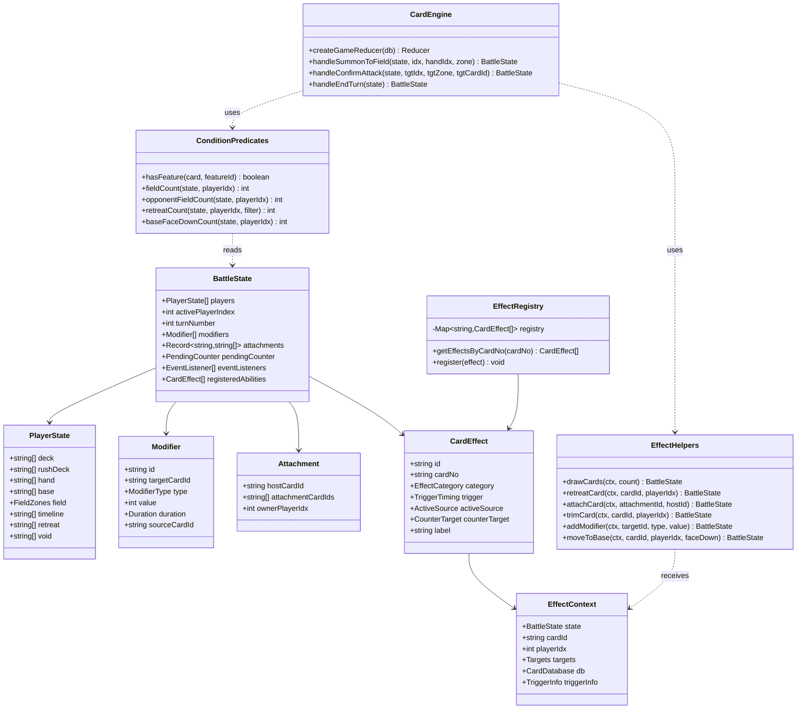
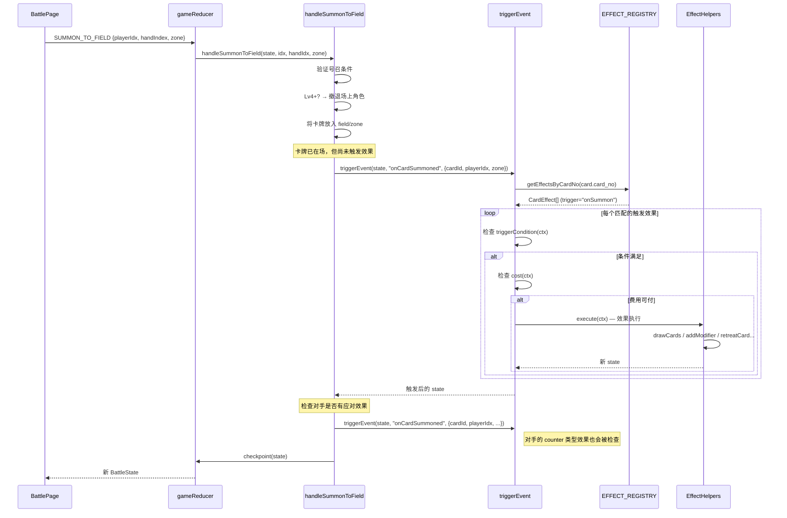
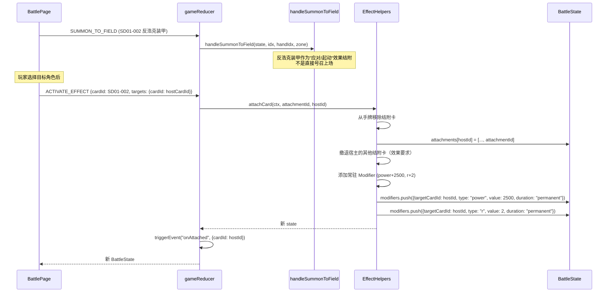
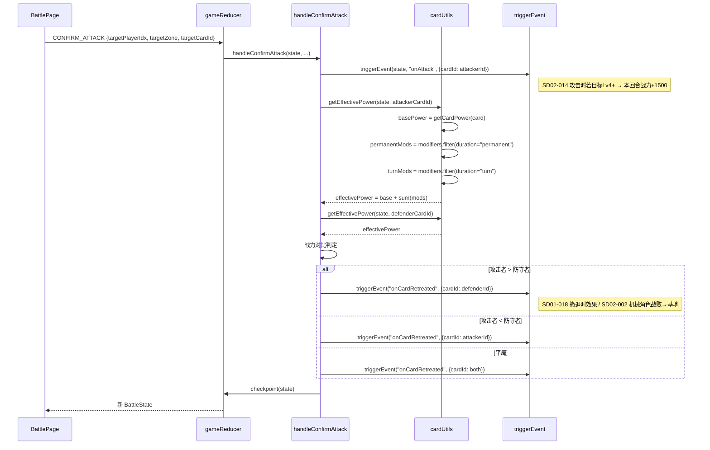
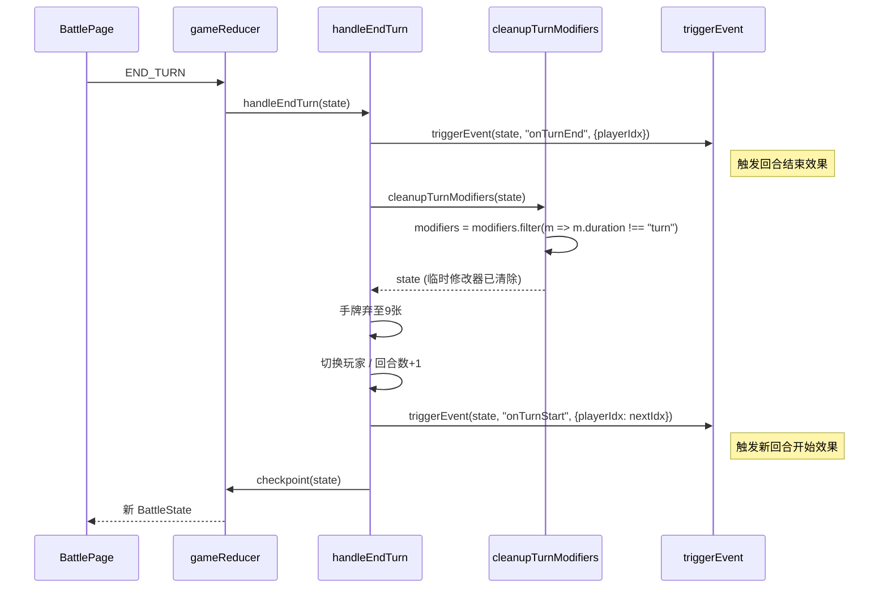
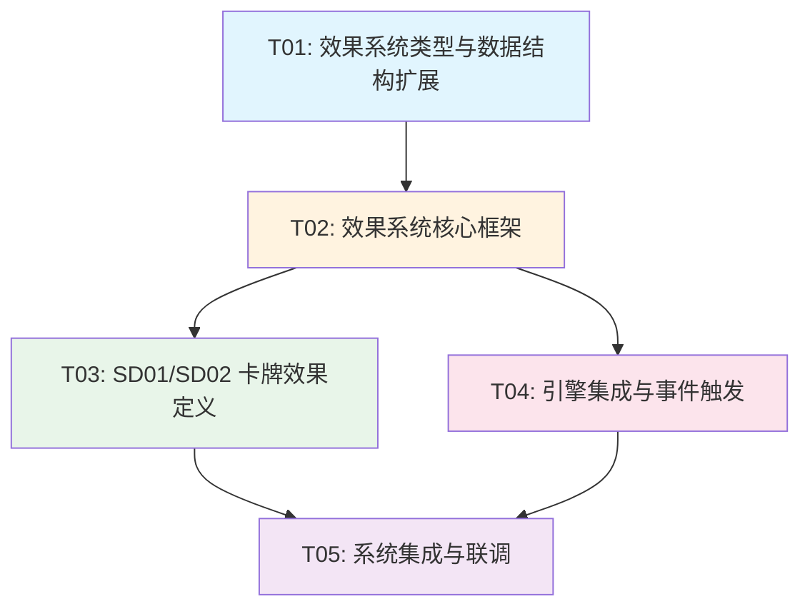

# SD01/SD02 卡效系统架构设计

> 架构师：高见远（Bob） | 项目：超英击战 Marvel TCG | 日期：2026-06-21

---

## Part A: System Design

### 1. Implementation Approach

#### 1.1 核心技术挑战

分析 SD01/SD02 全部 38 张角色卡的效果后，归纳出以下技术难点：

| 难点 | 涉及卡牌 | 描述 |
|------|---------|------|
| **结附系统** | SD01-002/009/010/016, SD02-006 | 卡牌"结附"于其他卡牌，被结附角色获得 buff；结附卡可被撤退/解除 |
| **R 值系统** | SD01-002/010, SD02-002/008/018 | R 值可被临时修改，需追踪本回合有效修改 |
| **临时战力修改** | SD01-003/004/007/014, SD02-001/003/009/014/017/018 | "本回合战力±X000"，回合结束清除 |
| **常驻条件效果** | SD01-004/008/017, SD02-001/003/018 | 条件满足时持续生效的条件 buff |
| **裁剪机制** | SD01-001/015 | 将场上角色直接移至撤退区（不经过战斗判定） |
| **应对机制** | SD01-001/002/011/016, SD02-004 | 对手号召时可"应对"（反制） |
| **特征判定** | SD01-010(人类), SD02-001/002/006/010/015(机械) | 从 `feature` 字段解析特征并判定 |
| **盖伏/翻开** | SD01-009, SD02-002/005/008/009/011 | 基地盖卡的翻开、展示操作 |
| **手牌起动** | SD01-006/009/010, SD02-007 | 从手牌发动的起动效果 |
| **基地起动** | SD02-005/008/009 | 从基地发动的起动效果 |

#### 1.2 架构选型与设计思路

**函数式数据驱动 + 闭包注入**（延续现有引擎风格）：

- **不引入新框架**：现有引擎是纯函数 reducer + 柯里化注入 CardDatabase 的模式。卡效系统延续此模式，所有效果定义为纯函数，通过 `EffectContext` 传递状态。
- **效果注册表模式**：每张卡的多个效果在模块加载时注册到全局 `EFFECT_REGISTRY`，引擎通过 `card_no` 查找。
- **分层设计**：
  - **类型层**（types）：定义所有接口
  - **框架层**（registry/helpers/conditions）：通用效果执行框架
  - **定义层**（sd01/sd02）：具体卡牌效果
  - **集成层**（engine/events）：在引擎关键位置插入触发点

**为什么不使用声明式 DSL**：
- SD01/SD02 的效果差异极大（裁剪、结附、抽卡、特征判定、条件 buff…），声明式 DSL 需要覆盖所有变体，复杂度不低于直接写函数
- 现有 `Ability` 接口已采用函数式 `condition/cost/effect`，保持一致性
- 函数式定义更灵活，TypeScript 类型检查可提供编译时安全

---

### 2. File List

```
src/game/
  types.ts                    [修改] 引擎类型：新增 TriggerTiming/ActiveSource/EffectCategory 等类型
  engine.ts                   [修改] 核心引擎：在 7 个关键位置插入事件触发
  events.ts                   [修改] 事件系统：新增 onStatChange/onAllyDefeated 等事件类型
  abilities.ts                [修改] 能力系统：新增 resolveCardEffect / getCardEffects
  cardUtils.ts                [修改] 卡牌工具：新增 getEffectivePower/getEffectiveR
  effects/
    types.ts                  [新增] 效果系统类型：CardEffect/EffectContext/Modifier/Attachment
    registry.ts               [新增] 效果注册表：EFFECT_REGISTRY + getEffectsByCardNo
    helpers.ts                [新增] 效果辅助函数：drawCards/retreatCard/attachCard/trimCard 等
    conditions.ts             [新增] 条件谓词：hasFeature/fieldCount/opponentFieldCount 等
    sd01.ts                   [新增] SD01 全部 19 张卡的效果定义
    sd02.ts                   [新增] SD02 全部 19 张卡的效果定义
    index.ts                  [新增] 统一导出 + 注册初始化
src/types/
  game.ts                     [修改] 新增 attachments/modifiers/pendingCounter 字段
  card.ts                     [修改] 新增 r 字段（基础 R 值）
```

---

### 3. Data Structures and Interfaces

#### 3.1 类图



#### 3.2 关键数据结构变更

**`src/types/game.ts` — BattleState 新增字段**：

```typescript
// BattleState 新增
interface BattleState {
  // ... 现有字段 ...

  /** 临时修改器（本回合战力/R值修改，回合结束时清除 duration='turn' 的） */
  modifiers: Modifier[];

  /** 结附关系：key = 宿主卡ID, value = 结附卡ID数组 */
  attachments: Record<string, string[]>;

  /** 待处理的应对（对手号召时检查是否有应对可用） */
  pendingCounter: {
    summoningPlayerIdx: number;
    summoningCardId: string;
    summoningZone: Zone | "base";
  } | null;
}

/** 临时修改器 */
interface Modifier {
  id: string;
  /** 被修改的卡牌 ID */
  targetCardId: string;
  /** 修改类型 */
  type: "power" | "r" | "cost";
  /** 修改值（正数为增加，负数为减少） */
  value: number;
  /** 持续时间：turn=本回合结束清除, permanent=永久（结附提供） */
  duration: "turn" | "permanent";
  /** 来源卡牌 ID（用于解除） */
  sourceCardId: string;
}
```

**`src/types/card.ts` — Card 新增字段**：

```typescript
interface Card {
  // ... 现有字段 ...
  /** 基础 R 值（若数据中无此字段，默认为 1） */
  r?: number;
}
```

**`src/game/effects/types.ts` — 效果系统核心类型**：

```typescript
/** 效果分类 */
type EffectCategory = "trigger" | "static" | "active" | "counter";

/** 触发时机 */
type TriggerTiming =
  | "onSummon"         // 号召进场时
  | "onRetreat"        // 撤退时
  | "onAttack"         // 攻击时
  | "onAttached"       // 被结附时
  | "onStatChange"     // 我方角色R或战力增加时
  | "onAllyDefeated"   // 我方角色战败进撤退区时
  | "onTurnStart"      // 回合开始时
  | "onTurnEnd";       // 回合结束时

/** 起动效果来源区域 */
type ActiveSource = "hand" | "base" | "field";

/** 应对目标 */
type CounterTarget = "summon" | "attack";

/** 效果执行上下文 */
interface EffectContext {
  state: BattleState;
  /** 效果来源卡牌 ID */
  cardId: string;
  /** 施放者玩家 index */
  playerIdx: number;
  /** 卡牌数据库（通过闭包注入） */
  db: CardDatabase;
  /** 选定的目标 */
  targets?: {
    cardId?: string;       // 目标卡牌
    zone?: Zone;           // 目标区域
    playerIdx?: number;    // 目标玩家
    cardIds?: string[];    // 多目标（如撤退2张卡）
  };
  /** 触发信息（触发型效果时填充） */
  triggerInfo?: {
    event: TriggerTiming;
    sourceCardId?: string;  // 触发源卡牌
    sourcePlayerIdx?: number;
  };
}

/** 卡牌效果定义 */
interface CardEffect {
  /** 唯一标识：`${cardNo}-${effectIndex}` */
  id: string;
  /** 关联卡牌 card_no */
  cardNo: string;
  /** 效果分类 */
  category: EffectCategory;

  // --- 触发型效果 ---
  trigger?: TriggerTiming;
  /** 触发条件（可选） */
  triggerCondition?: (ctx: EffectContext) => boolean;

  // --- 起动型效果 ---
  activeSource?: ActiveSource;
  /** 是否需要盖伏此卡作为执行后结果 */
  faceDownAfterActive?: boolean;

  // --- 应对型效果 ---
  counterTarget?: CounterTarget;

  // --- 通用 ---
  /** 费用检查（返回 true 表示可支付，副作用在 execute 中扣费） */
  cost?: (ctx: EffectContext) => boolean;
  /** 执行条件（static: 何时生效; active/trigger: 是否可执行） */
  condition?: (ctx: EffectContext) => boolean;
  /** 效果执行 */
  execute: (ctx: EffectContext) => BattleState;
  /** 常驻修改器计算（仅 static 类型，返回当前应施加的修改值） */
  staticModifier?: (ctx: EffectContext) => Modifier | null;
  /** 目标选择规格（UI 层用于提示玩家选目标） */
  targetSpec?: TargetSpec;
  /** 是否一次性效果 */
  once?: boolean;
  /** 显示名称（主动能力用） */
  label?: string;
}

/** 目标选择规格 */
interface TargetSpec {
  /** 目标数量 */
  count: number;
  /** 目标区域 */
  zone: "myField" | "opponentField" | "myBase" | "myRetreat" | "myHand" | "opponentVanguard";
  /** 过滤条件 */
  filter?: {
    maxLevel?: number;
    minLevel?: number;
    feature?: number;
    attribute?: number;
  };
  /** 是否可选（false=必须选满, true=可选0~count） */
  optional?: boolean;
}
```

---

### 4. Program Call Flow

#### 4.1 号召进场触发流程



#### 4.2 结附系统流程（反浩克装甲）



#### 4.3 战斗判定 + 临时战力修改流程



#### 4.4 回合结束清除临时效果流程



---

### 5. Anything UNCLEAR

1. **R 值的来源**：当前 Card 接口无 `r` 字段。根据 SD02-018 检查"R=1"，假设所有角色基础 R=1。若实际卡牌数据中有 R 值字段，需调整 `getEffectiveR` 的基础值来源。

2. **应对机制的交互流程**：当玩家A号召时，玩家B可"应对"。当前设计是在 `onCardSummoned` 事件中检查对手的 counter 类型效果，但实际 TCG 中应对通常有"响应窗口"（优先权切换）。当前简化为：在号召完成后立即检查对手是否有可用应对，若有则暂停号召效果直到应对解决。完整实现可能需要引入 `pendingCounter` 状态和优先权系统，但 SD01/SD02 的应对效果较为简单（反制号召/攻击），可暂用同步处理。

3. **结附卡的区域归属**：结附卡从手牌发出后，物理上不在任何 zone（hand/field/base/deck/retreat）中，而是存在于 `attachments` 映射中。当宿主撤退时，结附卡一并进入撤退区。此设计假设结附卡不被单独 targeting（除 SD01-001 的"撤退结附卡"效果外）。

4. **"本回合"的精确边界**：临时修改器 `duration: "turn"` 在回合结束时清除。但部分效果可能是"直到下次自己回合"，需确认。当前统一按"回合结束清除"处理。

5. **基地盖卡的翻开状态追踪**：当前 `base: string[]` 只存卡ID。部分效果需要"展示基地盖卡"或"翻开盖卡"。需在 base 中追踪每张卡的翻开状态，或新增 `baseFaceUp: string[]` 辅助字段。当前设计假设基地卡默认盖放，翻开操作将卡移至一个新的追踪字段。

6. **SD01-001 的复杂条件**："被结附时，若敌方战区有Lv5+角色，可撤退此卡所有结附卡，裁剪敌方1张LvX以下角色"涉及多步操作和多目标选择，可能需要 UI 层的多步选择流程支持。

---

## Part B: Task Decomposition

### 6. Required Packages

```
# 无新增第三方包 — 全部基于现有项目依赖实现
# 现有依赖已足够：
# - react@^18.2.0: UI 框架
# - typescript: 类型系统
# - vite: 构建工具
# 卡效系统完全使用 TypeScript 原生实现，不引入额外库
```

---

### 7. Task List (ordered by dependency)

#### T01: 效果系统类型与数据结构扩展

- **Task Name**: 效果系统类型与数据结构扩展
- **Source Files**:
  - `src/game/effects/types.ts` [新增] — 效果系统核心类型（CardEffect/EffectContext/Modifier/TargetSpec 等）
  - `src/game/types.ts` [修改] — 新增 TriggerTiming/ActiveSource/EffectCategory 到 GameEventType，扩展 AbilityContext
  - `src/types/game.ts` [修改] — BattleState 新增 modifiers/attachments/pendingCounter 字段；PlayerState 不变
  - `src/types/card.ts` [修改] — Card 接口新增可选 `r?: number` 字段
- **Dependencies**: 无
- **Priority**: P0
- **Description**: 定义卡效系统的全部类型基础。包括：Modifier（临时修改器）、EffectContext（效果执行上下文）、CardEffect（卡牌效果定义）、TargetSpec（目标选择规格）、TriggerTiming（触发时机枚举）。同时扩展 BattleState 增加 modifiers/attachments/pendingCounter 三个新字段，修改 GameEventType 增加 onStatChange/onAllyDefeated 事件。

---

#### T02: 效果系统核心框架

- **Task Name**: 效果系统核心框架（注册表 + 辅助函数 + 条件谓词 + 能力解析）
- **Source Files**:
  - `src/game/effects/registry.ts` [新增] — 全局效果注册表 EFFECT_REGISTRY，registerEffect/getEffectsByCardNo/triggerEffectsByTiming
  - `src/game/effects/helpers.ts` [新增] — 通用效果辅助函数：drawCards/retreatCard/attachCard/detachCard/trimCard/addModifier/removeModifier/moveToBase/summonFromRetreat
  - `src/game/effects/conditions.ts` [新增] — 条件谓词函数：hasFeature/fieldCount/opponentFieldCount/retreatCount/baseFaceDownCount/getCardLevel/hasAttachment
  - `src/game/abilities.ts` [修改] — 新增 resolveCardEffect（按 card_no 查找并执行效果）、getCardEffects、registerCardEffects（批量注册）
- **Dependencies**: T01
- **Priority**: P0
- **Description**: 实现效果系统的核心运行时框架。registry.ts 维护 card_no → CardEffect[] 的映射，提供按时机查询触发效果的能力。helpers.ts 封装所有原子操作（抽卡/撤退/结附/裁剪/修改器增删/基地操作），每个函数接收 EffectContext 返回新 BattleState。conditions.ts 提供复用的条件判定函数（特征判定从 feature 字段逗号分隔解析）。abilities.ts 扩展为支持按 card_no 解析卡牌效果。

---

#### T03: SD01/SD02 卡牌效果定义

- **Task Name**: SD01/SD02 全部 38 张卡牌效果定义
- **Source Files**:
  - `src/game/effects/sd01.ts` [新增] — SD01 全部 19 张卡的 CardEffect 定义（含结附/触发/常驻/应对/起动）
  - `src/game/effects/sd02.ts` [新增] — SD02 全部 19 张卡的 CardEffect 定义（含机械特征/基地操作/盖伏）
  - `src/game/effects/index.ts` [新增] — 统一导出 + registerAllEffects() 初始化函数（调用 sd01/sd02 注册）
- **Dependencies**: T01, T02
- **Priority**: P1
- **Description**: 为 SD01 和 SD02 的每张卡牌定义具体效果。SD01 重点是反浩克装甲的结附系统（SD01-002/009/010/016）、钢铁侠的触发效果（SD01-001/007/014）、浩克的常驻条件效果（SD01-008/017）。SD02 重点是奥创/幻视的机械特征联动（SD02-001/002/006/010/015）、基地起动效果（SD02-005/008/009）、黑豹的应对和先锋/后卫效果（SD02-003/016）。无效果的卡牌（SD01-012/013, SD02-012/013）不注册效果。index.ts 提供统一注册入口。

---

#### T04: 引擎集成与事件触发

- **Task Name**: 引擎事件触发点 + 事件系统增强 + 战力/R值计算
- **Source Files**:
  - `src/game/engine.ts` [修改] — 在 7 个关键位置插入 triggerEvent 调用：handleSummonToField(onCardSummoned)、handleConfirmAttack(onCardAttacked+onCardRetreated)、handleEndTurn(onTurnEnd+onTurnEnd cleanup+onTurnStart)、handleDeployToBase(onCardDeployed)、handleAdvancePhase(onPhaseChange)
  - `src/game/events.ts` [修改] — triggerEvent 增强：支持活跃玩家优先排序、支持嵌套触发防重入、新增 onStatChange/onAllyDefeated 事件分发
  - `src/game/cardUtils.ts` [修改] — 新增 getEffectivePower（基础战力+permanent修改器+turn修改器）、getEffectiveR（基础R+修改器）、getAttachments（查询结附卡）、cleanupTurnModifiers（清除 turn 修改器）
- **Dependencies**: T01, T02
- **Priority**: P0
- **Description**: 将事件系统接入引擎。在 engine.ts 的 handleSummonToField 中，卡牌上场后触发 onCardSummoned 事件；在 handleConfirmAttack 中，战斗判定前触发 onCardAttacked，撤退后触发 onCardRetreated；在 handleEndTurn 中触发 onTurnEnd → 清除临时修改器 → 切换玩家 → onTurnStart。cardUtils.ts 的 getEffectivePower 替换原有 getCardPower 在战斗判定中的调用，使临时战力修改生效。

---

#### T05: 系统集成与联调

- **Task Name**: 效果注册初始化 + 引擎接入效果系统 + 端到端联调
- **Source Files**:
  - `src/game/effects/index.ts` [补充] — 确保 registerAllEffects() 在游戏初始化时被调用
  - `src/game/engine.ts` [补充] — createGameReducer 工厂函数中调用 registerAllEffects(db)，在 SETUP_COMPLETE 处理中初始化效果注册
  - `src/game/abilities.ts` [补充] — resolveCardEffect 完整实现，处理多效果执行顺序、应对效果中断逻辑
- **Dependencies**: T03, T04
- **Priority**: P1
- **Description**: 将所有组件整合。在 createGameReducer 中注入 CardDatabase 后调用 registerAllEffects(db) 完成全局效果注册。确保引擎的 triggerEvent 能正确查找到注册的卡牌效果并执行。验证关键流程：号召→触发进场效果→对手应对检查→战斗判定→临时战力修改→撤退触发→回合结束清除。处理边界情况：结附卡撤退时宿主修改器移除、多效果同时触发时的执行顺序。

---

### 8. Shared Knowledge

```
=== 数据格式约定 ===
- Card.feature 字段为逗号分隔的特征 ID 字符串（如 "1,2" = 人类/复仇者联盟）
- 特征 ID 映射：1=人类, 2=复仇者联盟, 3=机械, 4=阿斯加德, 5=瓦坎达, 7=神盾局, 8=变种人, 9=九头蛇
- Card.attribute 字段为属性数字（1=科技/红色, 2=正义/黄色, 3=自然, 4=敏捷, 7=通用）
- Card.cost 即 Lv 值（1~6）
- Card.power 为字符串形式数字（如 "3000"），需 parseInt

=== 状态修改约定 ===
- 所有状态修改必须返回新的 BattleState 对象（不可变更新）
- Modifier.duration="turn" 的修改器在 handleEndTurn 中清除
- Modifier.duration="permanent" 的修改器在来源卡牌撤退/解除时移除
- 结附卡存在于 BattleState.attachments[hostCardId] 中，不在任何 zone 数组中
- 宿主卡撤退时，其所有结附卡一并进入撤退区

=== 效果执行约定 ===
- 效果通过 card_no 关联到卡牌（同一 card_no 的不同 variant 共享效果定义）
- 一张卡可注册多个 CardEffect（如 SD01-009 有起动+触发两种效果）
- 触发顺序：活跃玩家的效果优先（参考 Netrunner trigger-event-simult 规则）
- 应对效果（counter）在对手行动完成后同步检查，暂不实现优先权窗口
- 效果的 cost 函数只检查是否可支付，实际扣费在 execute 中执行
- static 效果不注册为 EventListener，而是在 getEffectivePower/getEffectiveR 中实时计算

=== 引擎集成约定 ===
- triggerEvent 调用必须在状态修改完成后（卡牌已上场/已撤退）进行
- checkpoint 函数负责在 action 处理后触发待处理事件
- 战斗判定中使用 getEffectivePower 而非 getCardPower（后者不计算修改器）
- handleEndTurn 中清除 turn 修改器的步骤在 onTurnEnd 触发之后、切换玩家之前

=== 文件组织约定 ===
- src/game/effects/ 为新增目录，所有效果系统文件在此
- 效果定义文件（sd01.ts/sd02.ts）只定义 CardEffect 对象，不包含执行逻辑
- 执行逻辑全部在 helpers.ts 中，效果定义通过调用 helpers 函数实现
- conditions.ts 中的函数可被效果定义的 condition/cost 字段复用
```

---

### 9. Task Dependency Graph



---

## Appendix: SD01/SD02 效果分类汇总

### 效果类型统计

| 类型 | SD01 卡牌 | SD02 卡牌 | 合计 |
|------|----------|----------|-----|
| 触发(onSummon) | 005,007,014,015 | 006,010,015,016,017 | 9 |
| 触发(onRetreat) | 009,018 | 002 | 3 |
| 触发(onAttack) | — | 014 | 1 |
| 触发(onStatChange) | 003 | — | 1 |
| 触发(onAllyDefeated) | — | 011 | 1 |
| 常驻(static) | 004,008,017 | 001,003,018 | 6 |
| 起动(hand) | 006,009,010 | 007 | 4 |
| 起动(base) | — | 005,008,009 | 3 |
| 起动(field) | — | 006 | 1 |
| 应对(counter) | 001,002,011,016 | 004 | 5 |
| 无效果 | 012,013 | 012,013 | 4 |

### 结附卡汇总

| 卡牌 | 结附目标 | Buff | 附加效果 |
|------|---------|------|---------|
| SD01-002 | 我方角色 | R+2, 战力+2500 | 撤退宿主1张其他结附卡 |
| SD01-009 | 我方角色 | — | 撤退时：展示基地盖卡，2张同Lv角色→基地 |
| SD01-010 | 我方【人类】角色 | R+1 | — |
| SD01-016 | 我方角色 | 战力+1000 | 撤退宿主所有其他结附卡 |
| SD02-006 | 自身 | — | 号召时从撤退区结附2张Lv1机械角色；起动解除1张至基地 |
